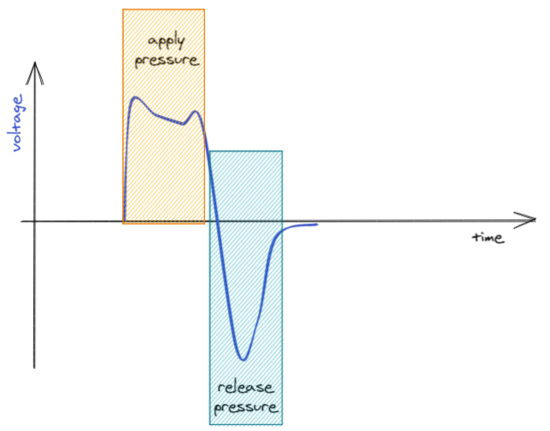
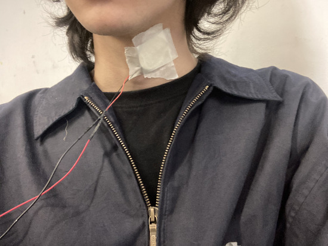
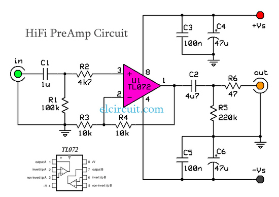
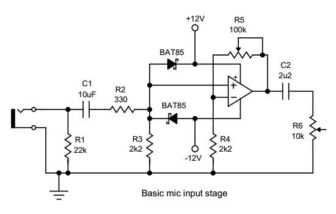

# proyecto-02

## Grupo

Número de grupo: 01

Tema del grupo: Piezo

Integrantes:

- Benjamín Alonso Álvarez Pavez / [benjaminalvarez21](<https://github.com/disenoUDP/dis8644-2026-1-procesos-2/tree/main/03-benjaminalvarez21>)
- Anays Valentina Cornejo Candia / [Anaysval](<https://github.com/disenoUDP/dis8644-2026-1-procesos-2/tree/main/09-Anaysval>)
- Bruno Ferrari Meyer / [chknngttts](<https://github.com/disenoUDP/dis8644-2026-1-procesos-2/tree/main/11-chknngttts>)
- Lucas Ignacio Ortiz Aguirre / [ryukivol](<https://github.com/disenoUDP/dis8644-2026-1-procesos-2/tree/main/21-ryukivol>)
- Nicolás Elías Valdés Greve / [nicolasvaldesgreve](<https://github.com/disenoUDP/dis8644-2026-1-procesos-2/tree/main/31-nicolasvaldesgreve>)

## Circuito 1

maincra

### Descripción general/conceptual 1

Este módulo te permite interactuar con el sintetizador mediante vibraciones en el piezo, tales como golpes en la misma superficie en la que se encuentra el componente o utilizándolo en nuestro cuerpo y causar vibraciones con nuestra garganta. Estas vibraciones serás captadas por el piezo, lo cual lo tomará como señal para avanzar en el secuenciador.

### Descripción de funcionamiento 1

El circuito se conforma de 7 partes:
  - Piezoeléctrico
  - Pre-Amp (TL072)
  - Inversor de señal (2N2222)
  - Regulador de voltaje (L7805CV)
  - Filtro Low-pass
  - Clock (NE555P)
  - Secuenciador (CD4017)

Como estándar en el trabajo todos tenemos que alimentar nuestro circuito con 5V. Para esto usamos el L7805CV

El piezo tiene 3 estados al recibir señal.

Para que el Pre-Amp pueda recibir la señal correctamente se necesita crear un voltaje medio entre VCC y GND. Para esto se usan 2 Resistencias del mismo valor, que dividen el voltaje a la mitad **``5V ---> 2.5V``**, esto permite que capte la señal completa y funcione correctamente. El Pre-Amp en nuestro caso también funciona para aumentar la sensibilidad del piezo, normalmente este solo detecta las señales directas al disco cerámico del piezo, pero con el Pre-Amp logramos que detecte señales a varios centímetros de este. 

Para afinar la señal que recibe el inversor, colocamos un filtro low-pass, esto permite que solo corriente bajo los 500hz *aprox.* avancen en el circuito. Esta señal entra al transistor (2N2222) que invierte la señal que recibe, puesto que el Clock (NE555P) busca recibir señales negativas en su Trigger [pin 2] para funcionar. El Clock en modo monoestable se conecta con el pin 14 del secuenciador (CD4017) para que señale cuando se avanza en los steps. 

### Descubrimientos

- Modificando los valores de las resistencias, se logra amplificar la sensibilidad del piezo (gracias misaaaaaa).
- Tener protoboard con los orificios **no** suelto es vital para que el circuito sea estable y se pueda mover.
- Que ciertos amplificadores tienen usos específicos, como el LM386 que es óptimo para parlantes, pero no piezos.
- Se pueden sustituir componentes con valores diferentes **``2.2k Ω ---> 47 Ω``**

### Esquemático 

### PCB 1

### Documentación audiovisual funcionamiento protoboard 1

[video-piezo-01](https://youtu.be/JZCzPmO_yxs)

### BOM

| Componente | Cantidad | Valor unitario | Link |
| --- | --- | --- | --- |
| Chip NE555P | 1 | $490 | <https://www.victronics.cl/circuitos-integrados/lm555cngeneralpurposebipolartimerdip8/> |
| Chip TL072CP | 1 | $990 | <https://www.victronics.cl/circuitos-integrados/tl072cpdualjfetlowpoweropamplifierdip8/> |
| Chip CD4017 | 1 | $890 | <https://www.mechatronicstore.cl/circuito-integrado-4017-contador/?srsltid=AfmBOopG29clQvJ0CqcNNp17wxEDjZ1w8dAWqRPMAcTqycciqYjHE40h>
| Regulador L7805CV | 1 | $350 | <https://www.victronics.cl/reguladores/reguladorvoltl7805cv5v-15ato220/> |
| Diodo 1N4007 | 1 | $200 | <https://www.mechatronicstore.cl/diodo-rectificador-in4007-1n4007-4007/> |
| Diodo BAT85 | 2 | $586 | <https://cl.rsdelivers.com/product/nexperia/bat85113/nexperia-diodo-bat85113-diodo-schottky-200-ma-30-v/0300978> |
| Transistor 2N2222 | 1 | $200 | <https://www.mechatronicstore.cl/transistor-2n2222/> |
| Potenciómetro B10K | 1 | $495 | <https://altronics.cl/potenciometro-lineal-10k-b10k> |
| Potenciómetro B500K | 1 | $495 | <https://altronics.cl/potenciometro-lineal-500k-b500k?search=b500k> |
| LED 3mm | 5 | $100 | <https://www.mechatronicstore.cl/led-3mm-5mm/> |
| Resistencia 47 Ω | 1 | $90 | <https://www.electroardu.cl/resistencias-1k-ohm?srsltid=AfmBOor81HKrzfoOTnLK3FU6ObPuf1EPUVMS0naCwqMNIzGt8LYDiUYt> |
| Resistencia 100 Ω | 1 | $90 | <https://www.electroardu.cl/resistencias-1k-ohm?srsltid=AfmBOor81HKrzfoOTnLK3FU6ObPuf1EPUVMS0naCwqMNIzGt8LYDiUYt> |
| Resistencia 220 Ω | 1 | $90 | <https://www.electroardu.cl/resistencias-1k-ohm?srsltid=AfmBOor81HKrzfoOTnLK3FU6ObPuf1EPUVMS0naCwqMNIzGt8LYDiUYt> |
| Resistencia 1 KΩ | 8 | $90 | <https://www.electroardu.cl/resistencias-1k-ohm?srsltid=AfmBOor81HKrzfoOTnLK3FU6ObPuf1EPUVMS0naCwqMNIzGt8LYDiUYt> |
| Resistencia 10 KΩ | 4 | $90 | <https://www.electroardu.cl/resistencias-1k-ohm?srsltid=AfmBOor81HKrzfoOTnLK3FU6ObPuf1EPUVMS0naCwqMNIzGt8LYDiUYt> |
| Resistencia 100 KΩ | 5 | $90 | <https://www.electroardu.cl/resistencias-1k-ohm?srsltid=AfmBOor81HKrzfoOTnLK3FU6ObPuf1EPUVMS0naCwqMNIzGt8LYDiUYt> |
| Condensador cerámico 4.7 nF | 1 | $100 | <https://www.mechatronicstore.cl/condensadores-ceramicos-distintos-valores/> |
| Condensador cerámico 10 nF | 1 | $100 | <https://www.mechatronicstore.cl/condensadores-ceramicos-distintos-valores/> |
| Condensador cerámico 100 nF | 4 | $100 | <https://www.mechatronicstore.cl/condensadores-ceramicos-distintos-valores/> |
| Condensador polarizado 10 µF | 2 | $100 | <https://www.mechatronicstore.cl/condensador-capacitorio-de-electrolitico-por-unidad-varios-valores/> |
| Condensador polarizado 100 µF | 3 | $100 | <https://www.mechatronicstore.cl/condensador-capacitorio-de-electrolitico-por-unidad-varios-valores/> | 
| Cables dupont 40 uni. | 1 | $2.990 | <https://mcielectronics.cl/shop/product/cable-dupont-macho-macho-20cm-pack-40-unidades-2/> |
| Cables caimán | 2 | $1.990 | <https://www.mechatronicstore.cl/cable-conector-cocodrilo-o-caiman-5-unidades/> |
| Batería 9V recargable | 1 | $7.990 | <https://www.sodimac.cl/sodimac-cl/articulo/110251085/bateria-recargable-9v/110251089> |
| Conector batería | 1 | $1.990 | <https://mcielectronics.cl/shop/product/conector-para-baterias-de-9v-9800/?srsltid=AfmBOorf4iqHmZZbBCSLCPoI-UFTBMuBMtXEwLw-ia48KteW5jir8sIx> |
| Piezo | 1 | $990 | <https://www.mechatronicstore.cl/sensor-piezoelectrico-27mm-con-cable/> |
| Interruptor Switch | 1 | $570 | <https://www.katode.cl/switches/1339-interruptor-switch-2-pines-on-off-corto.html?srsltid=AfmBOorJlIeUySzAORFwXSattHKE4BKH2LmhhXZS_8fZ4MW-G6kwnxqA> |

## Circuito 2

Budumtz

### Descripción general/conceptual 2

Este módulo, al igual que el anterior, permite que uno pueda interactuar con el sintetizador al que esté conectado el piezo, pero en este caso se necesita contacto directo al componente lo cual permitirá que lo que esté conectado a este se active.

### Descripción de funcionamiento 2

El circuito se conforma por 4 partes:

+ Piezoeléctrico
+ High pass filter
+ Op-Amp (LM324)
+ Inversor de señal (2N2222)
+ Regulador de voltaje (L7805CV)

Este circuito emplea el funcionamiento de *activador* es decir, envía señal a un módulo siguiente, el cual para verificar su funcionamiento se utiliza un led o se puede conectar a una salida de audio utilizando un Amp y parlante. 

El chip LM324 se utiliza como DC offset, regulando el voltaje bajando a la mitad **``9V ---> 4.5V``**. Además, cuenta con una salida de audio [pin 7] que utilizamos como salida para el siguiente módulo. De esta manera al interactuar con el piezo la señal se ve distorsionada por un breve periodo de tiempo ya que la señal que emite el circuito es constante.

En cuanto a los reguladores de voltaje, ya que nuestro chip LM324 cuenta con uno decidimos crear dos versiones, una con el estándar dado para la sección y uno con el integrado en el circuito.

Por otro lado, tuvimos un problema relacionado con la PCB, al ejecutar DRC da error: conexión de alivio térmico a zona incompleta al [pin 11] con el GND, problema que intentamos solucionar, pero no hubo éxito.

Archivo piezo-02-v03: Con regulador estándar.

Archivo piezo-02-v04: Solo regulador integrado.

### Esquemático 2

### PCB 2

### Documentación audiovisual funcionamiento protoboard 2

[video-piezo-02](https://youtu.be/MbAfNLuIrsg)

### BOM

| Componente | Cantidad | Valor unitario | Link |
| --- | --- | --- | --- |
| Chip LM324 | 1 | $590 | <https://www.mechatronicstore.cl/amplificador-operacional-lm324/?srsltid=AfmBOopyXPPvl24e9VRGUKZwKS9_gIp9S3hdacmTDOWF4O2ur2TF77QZ> |
| Potenciómetro B500K | 1 | $495 | <https://altronics.cl/potenciometro-lineal-500k-b500k?search=b500k> |
| LED 3mm | 1 | $100 | <https://www.mechatronicstore.cl/led-3mm-5mm/> |
| Transistor 2N2222 | 1 | $200 | <https://www.mechatronicstore.cl/transistor-2n2222/> |
| Resistencia 1 KΩ | 3| $90 | <https://www.electroardu.cl/resistencias-1k-ohm?srsltid=AfmBOor81HKrzfoOTnLK3FU6ObPuf1EPUVMS0naCwqMNIzGt8LYDiUYt> |
| Resistencia 10 KΩ | 1 | $90 | <https://www.electroardu.cl/resistencias-1k-ohm?srsltid=AfmBOor81HKrzfoOTnLK3FU6ObPuf1EPUVMS0naCwqMNIzGt8LYDiUYt> |
| Resistencia 22K KΩ | 1 | $90 | <https://www.electroardu.cl/resistencias-1k-ohm?srsltid=AfmBOor81HKrzfoOTnLK3FU6ObPuf1EPUVMS0naCwqMNIzGt8LYDiUYt> |
| Resistencia 100 KΩ | 3 | $90 | <https://www.electroardu.cl/resistencias-1k-ohm?srsltid=AfmBOor81HKrzfoOTnLK3FU6ObPuf1EPUVMS0naCwqMNIzGt8LYDiUYt> |
| Resistencia 1 MΩ | 3 | $90 | <https://www.electroardu.cl/resistencias-1k-ohm?srsltid=AfmBOor81HKrzfoOTnLK3FU6ObPuf1EPUVMS0naCwqMNIzGt8LYDiUYt> |
| Condensador cerámico 4.7 nF | 1 | $100 | <https://www.mechatronicstore.cl/condensadores-ceramicos-distintos-valores/> |
| Condensador cerámico 100 nF | 2 | $100 | <https://www.mechatronicstore.cl/condensadores-ceramicos-distintos-valores/> |
| Condensador polarizado 10 µF | 2 | $100 | <https://www.mechatronicstore.cl/condensador-capacitorio-de-electrolitico-por-unidad-varios-valores/>|
| Condensador polarizado 100 µF | 2 | $100 | <https://www.mechatronicstore.cl/condensador-capacitorio-de-electrolitico-por-unidad-varios-valores/> | 
| Cables dupont 40 uni. | 1 | $2.990 | <https://mcielectronics.cl/shop/product/cable-dupont-macho-macho-20cm-pack-40-unidades-2/> |
| Cables caimán | 2 | $1.990 | <https://www.mechatronicstore.cl/cable-conector-cocodrilo-o-caiman-5-unidades/> |
| Batería 9V recargable | 1 | $7.990 | <https://www.sodimac.cl/sodimac-cl/articulo/110251085/bateria-recargable-9v/110251089> |
| Conector batería | 1 | $1.990 | <https://mcielectronics.cl/shop/product/conector-para-baterias-de-9v-9800/?srsltid=AfmBOorf4iqHmZZbBCSLCPoI-UFTBMuBMtXEwLw-ia48KteW5jir8sIx> |
| Piezo | 1 | $990 | <https://www.mechatronicstore.cl/sensor-piezoelectrico-27mm-con-cable/> |
| Interruptor Switch | 1 | $570 | <https://www.katode.cl/switches/1339-interruptor-switch-2-pines-on-off-corto.html?srsltid=AfmBOorJlIeUySzAORFwXSattHKE4BKH2LmhhXZS_8fZ4MW-G6kwnxqA> |

## Otros circuitos

En el piezo 01 usamos el HiFi Pre-Amp Circuit de [jevron1984](https://electronics.stackexchange.com/questions/348898/need-some-help-building-a-tl072-preamp-circuit).

No era compatible con el circuito, después armamos un circuito propio utilizando el 2N2222, pero tampoco funcionó, por lo que lo sustituimos por el Pre-Amp de [PimPom](https://www.diyaudio.com/community/threads/tl072-as-mike-input-preamp.317907/).

En el piezo 02 armamos un Amp con el LM386, siguiendo el mismo esquemático que se nos entregó por misaaaaaa en el proyecto-01.

## Colaboración con otros grupos

### ¿Cómo ayudé a otro grupo?

+ Ayudamos al grupo 03 (osciladores 1) prestándoles dos potenciómetros B100K.
+ Ayudamos al grupo 03 (osciladores 1) con el comando para añadir imágenes en el README.md.
+ Ayudamos al grupo 03 (osciladores 1) con la gráfica de la PCB.
+ Ayudamos al grupo 06 (percutores) prestándoles la batería.
+ Ayudamos al grupo 06 (percutores) con las pistas en su PCB.

### ¿Cómo me ayudó otro grupo?

+ Santiago Cifuentes del grupo 04 (osciladores 2) nos ayudó con la compra de componentes y apoyo emocional de manera constante tanto dentro como fuera de clases.
+ Yaira Ruiz nos ayudó a agregar las carpetas que contienen las huellas del curso.
+ Martína Echavarria del grupo 06 (percutores) nos ayudó cargando la batería.

## Bibliografía

+ Colectivo 22bits. (2020, 8 1). Hybrida. GitHub. <https://github.com/22bits/Matrinicas/blob/master/Hybrida/HYBRIDA_Esquematico.pdf>

+ DigiKey. (n.d.). Voltage Divider Conversion Calculator. DigiKey. <https://www.digikey.com/en/resources/conversion-calculators/conversion-calculator-voltage-divider>

+ jevron1984. (2018, January 8). Need some help building a TL072 preamp circuit. Electronics Stack Exchange. <https://electronics.stackexchange.com/questions/348898/need-some-help-building-a-tl072-preamp-circuit>

+ misaaaaaa. (n.d.). transistoresDeclaman. GitHub. <https://github.com/misaaaaaa/transistoresDeclaman/blob/main/sch.pdf>

+ Pimpom. (2018, 1 25). TL072 as mike input preamp. diyAudio. <https://www.diyaudio.com/community/threads/tl072-as-mike-input-preamp.317907/>

+ kickstomp. (2021, 3 27). 06 Piezo Trigger. arduinokickstompdrum. <https://arduinokickstompdrum.wordpress.com/2021/05/27/06-piezo-trigger/>
