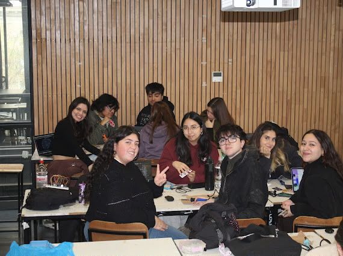
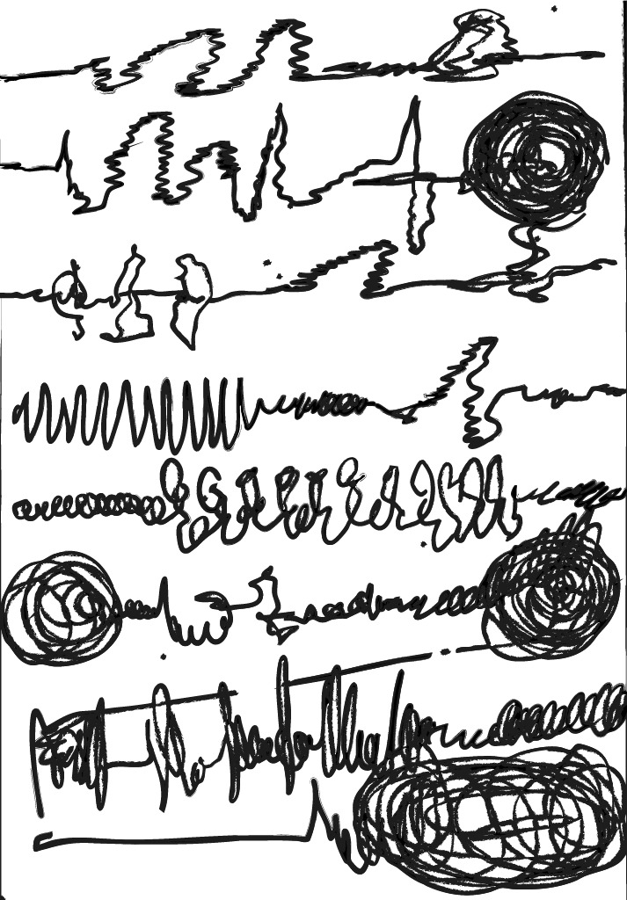
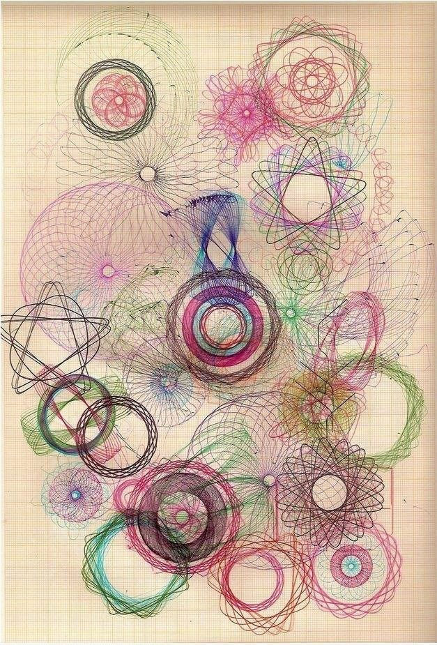

# Proyecto-03

Número de grupo: 03

Integrantes:

+ Vanessa García / vanessagarciaM
+ Antonia Loch / antoloch
+ Carla Núñez / ccarlabelenn
+ Ariel Orozco / arielorozco024
+ Narely Riquelme / Narelyriquelme
## Listado de materiales

### Comando estelar
| Componente | Tipo | Cantidad | Precio (c/u) | Comprar |
|------------|------|----------|---------------|----------|
| Chip CD4046 | Circuito Integrado | 1 | $700 | Electrónica Real |
| Chip CD40106 | Circuito Integrado | 1 | $1200 | Electrónica Real |
| L7805 | Regulador de Voltaje | 1 | $350 | Victronics |
| Diodo 1N4007 | Diodo | 1 | $790 | Victronics |
| LED | LED | 1 | $920 | Electrónica Real |
| Resistencia 100kΩ | Resistencia | 1 | $890 | Electrónica Real |
| Resistencia 1kΩ | Resistencia | 1 | $890 | Electrónica Real |
| Potenciómetro 100Ω | Potenciómetro | 2 | $500 | Afel a Ingeniería |
| Capacitor 10nF | Condensador Cerámico | 1 | $520 | Victronics |
| Capacitor 100nF | Condensador Cerámico | 1 | $500 | Victronics |
| Capacitor 100uF | Condensador Electrolítico | 2 | $670 | Victronics |
| Capacitor 10uF | Condensador Electrolítico | 2 | $330 | Victronics |
| Capacitor 1uF | Condensador Electrolítico | 1 | $300 | Victronics |
| Jack DC | Conector | 2 | $150 | Electrónica Real |
| Jack de audio | Conector | 1 | $150-$300 | Victronics |
| Interruptor de palanca SPDT ON-ON | Interruptor | 1 | 590 | Electrónica Real |
| Separador o tornillo de montaje (M3*8) | Tornilleria | 4 | $54 | Pernos Alameda |
| Cable Dupont | Cable | 19 | $1190 (pack 10) | MCI Electronics |

### Resonancia

| Componente | Tipo | Cantidad | Precio (c/u) | Comprar |
|------------|------|----------|---------------|----------|
| Chip CD4017 | Circuito Integrado | 1 | $890 | Electrónica Real |
| Chip CD4046 | Circuito Integrado | 1 | $700 | Electrónica Real |
| Chip CD40106 | Circuito Integrado | 1 | $1200 | Electrónica Real |
| L7805 | Regulador de Voltaje | 1 | $350 | Victronics |
| Resistencia 470kΩ | Resistencia | 2 | $1090 | Electrónica Real |
| Resistencia 330kΩ | Resistencia | 1 | $1090 | Electrónica Real |
| Resistencia 100kΩ | Resistencia | 1 | $890 | Electrónica Real |
| Resistencia 1kΩ | Resistencia | 1 | $890 | Electrónica Real |
| Potenciómetro 100kΩ | Potenciómetro | 2 | $500 | Afel a Ingeniería |
| Capacitor 100uF | Condensador Electrolítico | 2 | $670 | Victronics |
| Capacitor 10uF | Condensador Electrolítico | 1 | $330 | Victronics |
| Capacitor 4.7uF | Condensador Electrolítico | 1 | $370 | Victronics |
| Capacitor 1uF | Condensador Electrolítico | 1 | $300 | Victronics |
| Capacitor 100nF | Condensador Cerámico | 1 | $500 | Victronics |
| Diodo 1N4007 | Diodo | 1 | $790 | Victronics |
| LED | LED | 2 | $920 | Electrónica Real |
| Jack DC | Conector | 2 | $150 | Electrónica Real |
| Jack de audio | Conector | 1 | $150-$300 | Victronics |
| Interruptor de palanca SPDT ON-ON | Interruptor | 1 | $590 | Electrónica Real |
| Separador o tornillo de montaje (M3*8) | Tornilleria | 4 | $54 | Pernos Alameda |
| Cable Dupont | Cable | 19 | $1190 (pack 10) | MCI Electronics |

## Ensamblaje y soladura de placas

A partir de los componentes necesarios para nuestras placas, comenzamos el proceso de soldadura con estaño y cautín, colocando cada pieza en su PCB correspondiente y apoyándonos mutuamente para asegurarnos de que todo quedara correctamente ubicado y soldado. Fue un nuevo aprendizaje para todos, ya que era la primera vez que cada uno soldaba una PCB, y nos enriquecimos con ese conocimiento. 

Definimos con cuál PCB de otro grupo queríamos trabajar e implementar en nuestro proyecto. Nos decidimos por Barry Benson, “la abeja”, que es un percutor. Nos atrajo su sonido y la manera en que podía complementarse con nuestro oscilador. Adquirimos los componentes necesarios para soldarlos en la placa. 

De la misma manera, soldamos a Relo con los componentes que teníamos disponibles. 

## Partituras 

## Partitura comando estelar

Hicimos esta partitura a partir de lo que nos hacía imaginar el sonido de nuestro sintetizador, Comando Estelar. Mientras escuchábamos las distintas oscilaciones, cada uno fue dibujando libremente las formas que le transmitía el sonido. Por eso aparecen líneas onduladas, espirales, trazos más fuertes y otros más suaves.

La idea era representar visualmente cómo percibíamos el sonido. Algunas líneas más repetitivas representan sonidos constantes o vibraciones, mientras que los trazos más caóticos o las espirales representan sonidos más intensos o cambios bruscos que escuchábamos.

Elegimos las formas curvas y continuas porque se parecen a cómo funciona nuestro circuito en la realidad. Al mover la perilla del potenciómetro, el sonido no cambia de golpe o por saltos, sino que sube y baja como un flujo constante y fluido, lo que nos hizo dibujar esas líneas más suaves. Además, cuando el sonido del oscilador se ponía más intenso, concentrado o medio distorsionado, se nos ocurrió juntar los trazos y armar espirales para atrapar toda esa energía en el dibujo. Por otro lado, las ondas que dejamos más abiertas y tranquilas son para los momentos cuando el circuito tira sonidos más graves.

También, nos inspiramos en algunos referentes de partituras gráficas que vimos anteriormente, pero le dimos vida a nuestra pieza gráfica con la ayuda de nuestra interpretación de los sonidos del sintetizador.

## Partitura resonancia

Respecto a esta partitura, buscamos referentes de partituras experimentales y, en base a ello, nos gustó la idea de interpretarla no como una notación musical particular, sino llevarla más hacia elementos visuales que representaran lo que escuchábamos. Al prestar atención a cómo sonaba nuestro oscilador, cada uno interpretó mediante alguna forma, símbolo o línea aquello que percibía. Finalmente, coincidimos en esta forma de espiral, que aumenta o disminuye su tamaño según los cambios de intensidad, frecuencia y comportamiento del sonido.

Así, nuestra partitura lleva la experiencia auditiva al plano gráfico. Además, la repetición de los círculos y sus distintos tamaños representan cómo el sonido se expande y genera vibraciones.

## Referentes visuales partituras
Estos son algunos de los referentes visuales que utilizamos para inspirarnos. Observamos sus formas, composiciones y maneras de representar los sonidos de forma gráfica

