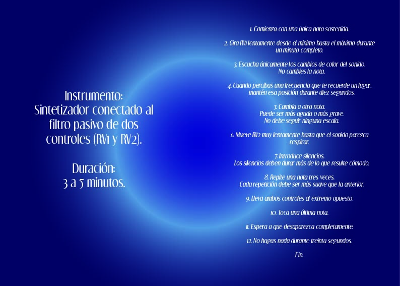

## Grupo

Grupo: **05**

Tema del grupo: **Filtro**

Integrantes:

 * Luisa Toro
 * Sebastian Guevara
 * Antonia Amestica
 * Catalina Jeria
 * Catalina Balboa 

## 1. Lista de materiales (bom):

### Chirigüe mecanizado: Grupo 4 - Oscilador

| Componente | Cantidad | valor unitario | link/Comprar |
|------------|----------|--------------|---------|
| Chip 40106 | - | $1.200 CLP | https://electronicareal.cl/producto/integrado-digital-cd-40106/?srsltid=AfmBOopGygR12K2_-zL_pf-RaOB5PvLmK7oy2TURaqkeA0zU1alOhJD- | 
| Chip LM324 | - | $590 CLP | https://www.mechatronicstore.cl/amplificador-operacional-lm324/ | | Regulador L7805 | 1 | $350 CLP | https://www.victronics.cl/reguladores/reguladorvoltl7805cv5v-15ato220/ | 
| Condensador 10 µF | 3 | $330 CLP | https://www.victronics.cl/condensadores/condensadorelectrolitico10uf50v/ | 
| Condensador 100 nF | 2 | $100 CLP | https://www.mechatronicstore.cl/condensadores-ceramicos-distintos-valores/ | 
| Condensador 100 µF | 1 | $380 CLP | https://www.victronics.cl/condensadores/cond-electrolitico-100uf-25v20105oc-6x12-p2-5mm-10u/ | 
| Diodo 1N4148 | - | $100 CLP | https://www.mechatronicstore.cl/diodo-rectificador-de-alta-frecuencia-1n4148-do35/ | 
| Diodo 1N4007 | 1 | $200 CLP | https://www.mechatronicstore.cl/diodo-rectificador-in4007-1n4007-4007/ | | Potenciómetro 100 kΩ | 4 | $495 CLP | https://altronics.cl/potenciometro-lineal-100k-b100k | 
| Resistencia 1 kΩ | 6 | $100 CLP | https://www.mechatronicstore.cl/resistencia/ | | LED | 2 | $300 CLP | https://www.mechatronicstore.cl/led-intermitente-5mm/ | 

###  Lub-dub: Grupo 6 - Percutor

| Componente | Cantidad | valor unitario | link/Comprar |
|------------|----------|--------------|---------|
| Chip 40106 | 1 | $1.200 CLP | https://electronicareal.cl/producto/integrado-digital-cd-40106/?srsltid=AfmBOopGygR12K2_-zL_pf-RaOB5PvLmK7oy2TURaqkeA0zU1alOhJD- | 
| Chip 4069 | 1 | $1.100 | <https://www.cabezacuadrada.cl/product/cd4069/> |
| L7805 | 1 | $490 | <https://www.mechatronicstore.cl/regulador-limitador-de-voltaje-5v-dc/> |
| Condensador 10 µF | 2 | $330 CLP | https://www.victronics.cl/condensadores/condensadorelectrolitico10uf50v/ | 
| Condensador 100 nF | 4 | $100 CLP | https://www.mechatronicstore.cl/condensadores-ceramicos-distintos-valores/ | 
| Condensador 10 nF | 1 | $100 CLP | https://www.mechatronicstore.cl/condensadores-ceramicos-distintos-valores/ | 
| Condensador 100 µF | 1 | $380 CLP | https://www.victronics.cl/condensadores/cond-electrolitico-100uf-25v20105oc-6x12-p2-5mm-10u/ | 
| Condensador 0.22 µF | 1 | $100 | <https://www.mechatronicstore.cl/condensador-capacitorio-de-electrolitico-por-unidad-varios-valores/> |
| Diodo 1N4007 | 1 | $200 CLP | https://www.mechatronicstore.cl/diodo-rectificador-in4007-1n4007-4007/ | | Potenciómetro 100 kΩ | 4 | $495 CLP | https://altronics.cl/potenciometro-lineal-100k-b100k | 
| Resistencia 1 kΩ | 1 | $100 CLP | https://www.mechatronicstore.cl/resistencia/ | | LED | 2 | $300 CLP | https://www.mechatronicstore.cl/led-intermitente-5mm/ | 
| Resistencia 100 kΩ | 2 | $100 | <https://www.mechatronicstore.cl/resistencias-electricas-1-2-w-1-unidad/> |
| Potenciometro 100K | 4 | $490 | <https://www.mechatronicstore.cl/potenciometro-rotacional-10k/> |
| Led | 1 | $100 | <https://www.mechatronicstore.cl/led-3mm-5mm/> |

###  Nyan Cat: Grupo 2 - Secuenciador 

| Componente | Cantidad | valor unitario | link/Comprar |
|------------|----------|--------------|---------|
| Chip 4015 | 1 | $1.400 | <https://www.mactronica.com.co/cd4015?srsltid=AfmBOopMDQhFv0vy6tj-sATCKe9rcEpOGbsfz7VMFRrBPl9Yq3KS80wU> | 
| Regulador L7805CV | 1 | $350 | <https://www.victronics.cl/reguladores/reguladorvoltl7805cv5v-15ato220/> | 
| Transistor 2N2222 | 8 | $220 | <https://www.cabezacuadrada.cl/product/pn2222a/> | 
| Transistor BC548 | 1 | $200 | <https://www.mechatronicstore.cl/transistor-bc548/?srsltid=AfmBOorIdGTZFY0mLCpBPP8JWl9WGDELQa-iZIZ95pKPjncWCgmXklr3> | 
| LED 3mm | 9 | $100 | <https://www.mechatronicstore.cl/led-3mm-5mm/> | 
| Resistencia 220 Ω | 8| $90 | <https://www.electroardu.cl/resistencias-1k-ohm?srsltid=AfmBOor81HKrzfoOTnLK3FU6ObPuf1EPUVMS0naCwqMNIzGt8LYDiUYt> | 
| Resistencia 1 kΩ | 18 | $90 | <https://www.electroardu.cl/resistencias-1k-ohm?srsltid=AfmBOor81HKrzfoOTnLK3FU6ObPuf1EPUVMS0naCwqMNIzGt8LYDiUYt> | Si |
| Resistencia 10 kΩ | 1 | $90 | <https://www.electroardu.cl/resistencias-1k-ohm?srsltid=AfmBOor81HKrzfoOTnLK3FU6ObPuf1EPUVMS0naCwqMNIzGt8LYDiUYt> | 
| Resistencia 100 kΩ | 1 | $90 | <https://www.electroardu.cl/resistencias-1k-ohm?srsltid=AfmBOor81HKrzfoOTnLK3FU6ObPuf1EPUVMS0naCwqMNIzGt8LYDiUYt> | 
| Diodo 1N4007 | 1 | $200 | <https://www.mechatronicstore.cl/diodo-rectificador-in4007-1n4007-4007/> | 
| Condensador cerámico 100 nF | 1 | $100 | <https://www.mechatronicstore.cl/condensadores-ceramicos-distintos-valores/> | 
| Condensador polarizado 10 µF | 1 | $100 | <https://www.mechatronicstore.cl/condensador-capacitorio-de-electrolitico-por-unidad-varios-valores/> | 
| Condensador polarizado 100 µF | 1 | $100 | <https://www.mechatronicstore.cl/condensador-capacitorio-de-electrolitico-por-unidad-varios-valores/> | 
| Interruptor Switch | 1 | $570 | <https://www.katode.cl/switches/1339-interruptor-switch-2-pines-on-off-corto.html?srsltid=AfmBOorJlIeUySzAORFwXSattHKE4BKH2LmhhXZS_8fZ4MW-G6kwnxqA> |

## 2. Ensamblaje

### Proceso tanto en clases y fuera de clases

## 3. Propuestas de partituras

### Propuesta 1

### Propuesta 2

### Propuesta 3 

