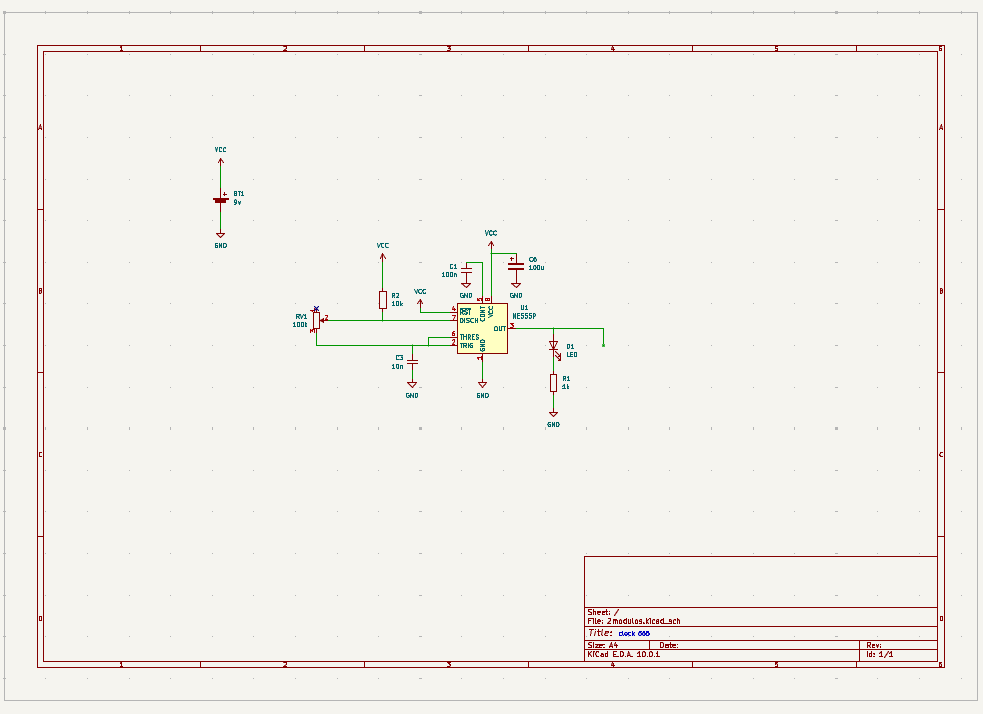
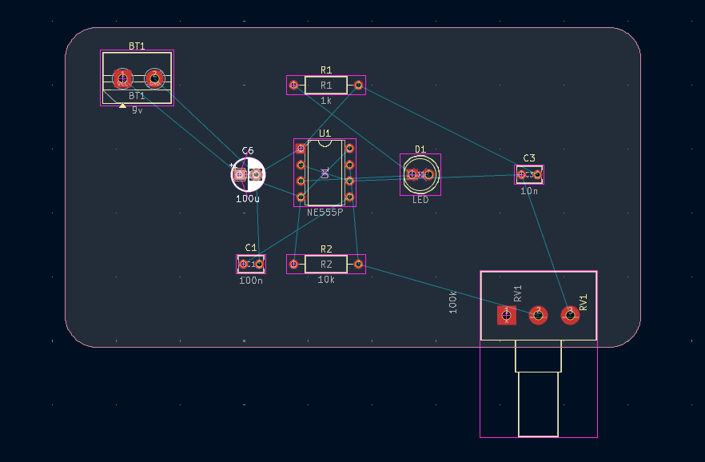
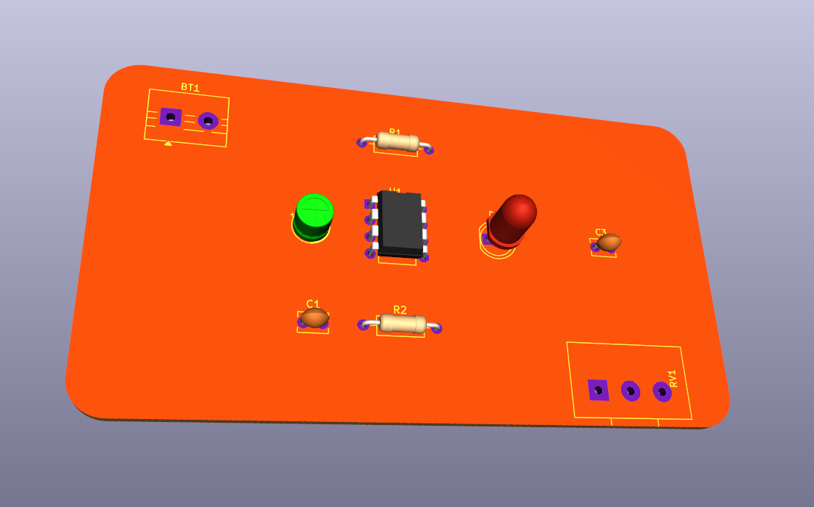
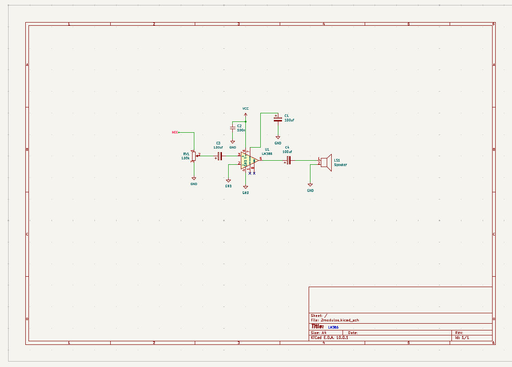
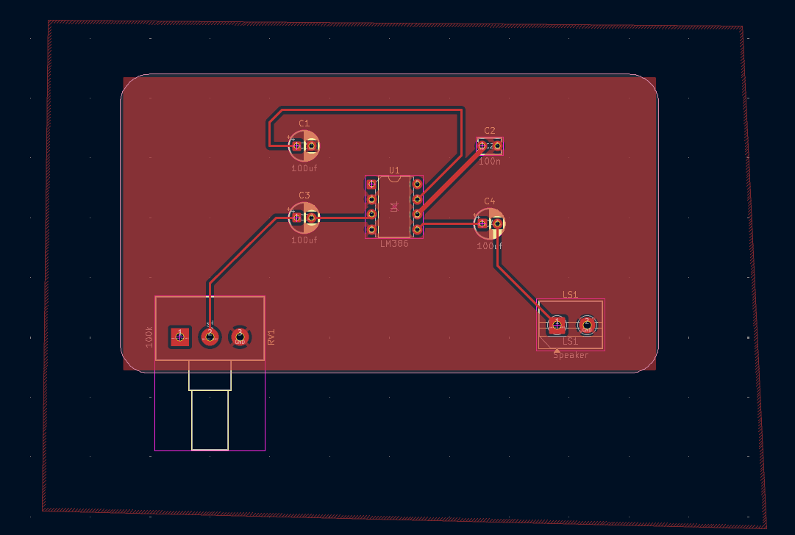
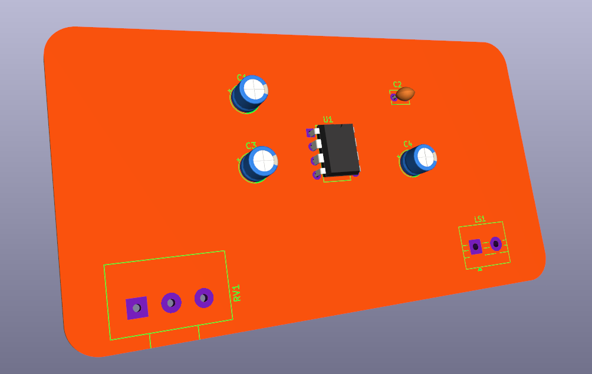

# sesion-09a

martes 12 de mayo

## clase online

- si apreto la A (agregar) puedo agregar componentes, si busco R aparecerán diferentes tipos de reistencias
- ESC para salir de la herramiento, click en el componente y M para mover
- E mueve el componente solo, la G (grab) mueve el componente con los cables
- click y V (valor) le podemos dar valor al componente (100k, 10k, etc)

### lista de comandos

- A = herramienta agregar símbolo
- ESC = herramienta selección
- M = mover componentes
- G = mover componente con todo lo que tiene conectado
- V = asignar valor a componente
- CTRL + S = guardar

### diccionario de huellas

## archivo pcb

- debo estar en la capa edge cuts para editar el borde de la placa
- para partir usar la grilla en 5mm, partir en 50 y 50
- hacer con la herramienta rectángulo uno de 90 x 50 mm y con la E podemos redondear los bordes y lo dejamos en 5 mm
- después se puede cambiar la grilla a 1 mm
- tamaños de pinceles de pistas 0.4 mm y 0.8 mm
- organizar componentes siguiendo una grilla y orden
- conectar positivos con pincel de 0.8 mm
- luego con el pincel de pistas más delgaditas trazar lo demás
- vías: pasar de un lado de un lado de la placa a la otra
- conectamos todo excepto  GND
- red = cable
- con la herramienta dibujar zonas rellenas seleccionamos la red GND y hacemos un rectangulo que cubra la placa, cerramos con B
- archivos > importar > gráficos > agregar archivo .dxf

### archivo en editor de placas

### placa en visualización 3D

## encargo-09a

### esquemáticos y PCB en KiCad

decidí hacer el clock 555 y el LM386, al principio me costó un poco pero ya al hacer el segundo ya sabía más o menos todo lo que tenia que hacer

### clock 555

### LM386

