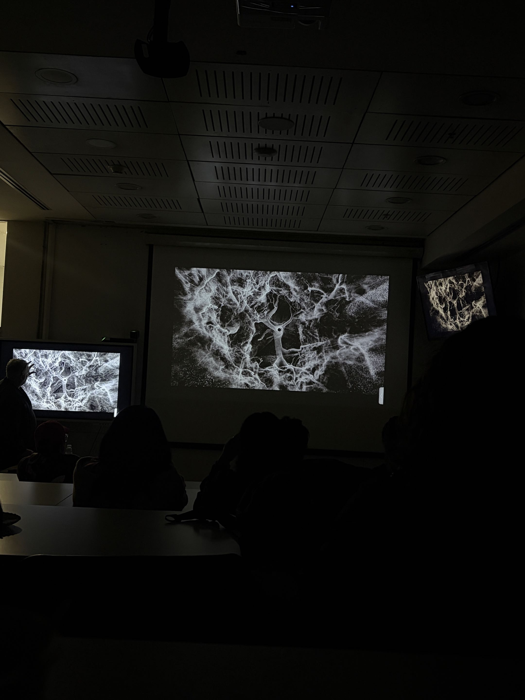

# sesion-10a

martes 19 de mayo

## charla auditorio

### For want of (not) measuring / Jim y Patrick

querían ver su trabajo junto con el de otros artistas, y así un trabajo se volvió varios.

**desde acá empecé a anotar casi todo en inglés mejor y hay varios apuntes sueltos igual**

how we use measurements in life, and also how we don't use measurements.
Patrick has a gallery: gallery project 78.
Patrick's work: the futility of Measuring.

- accept systems without thinking what can they mean.
- try to calculate the weight of world in 1717.
- escalate a mountan with "péndulos" they figure a 80% math weight, and he does always the same mountain.
- drawings, paintings

unstable system - Jim Hobbs, he likes when he look at systems who we think they are stable but you can see they are unstable.

"the grid with the frame can content a lot of things but it is unstable".

### about the proyect: they wanted to bring their work to the world, to share with people and cultures.

London and many more places

7 proyects / exhibitions.
they do a relation between the place and the proyect.

they bring 3 people to create publications: 1 artist 1 writer 1 curator.

### Simon

he showed us a scanner, it has a mirror spinning vertical and horizontal, and also it has a laser and it hits something in the world and comes back.
you can use it to create models, each point is a event of the laser hitting the world.

the connections of the points it is named clouds. a cloud has no limitations. sharp discontinuous. as the tree grows, is a net the (tronco) twists

- las ramas parecen relámpagos
- frecuencias y ondas.
- es todo un asunto de escala para nosotros.

el árbol es muy lento, para la montaña el árbol es muy lento.

una vez tiene los datos puede modificarlos.

picture inside the tree:

Film 16mm —

### clase

somos el grupo 4 y haremos osciladores 2!

integrantes:

- antokiaraa
- santiagocifuvelez
- paulafuentesm
- kristelagj
- catalinaoyanedel
- yairaruiz

### pequeño rato con misa

- puedo cambiar la frecuencia ya no con una resistencia sino que según el voltaje
- VCO oscilador controlado por voltaje, según el voltaje que le entre a la caja negra va a generar una frecuencia
- 4017 secuenciador con 4 salidas genera un voltaje el cual puedo ajustar con el potenciómetro y luego mandarlo a un VCO que según el valor del pote se modifica el sonido
- recomendación para oscilador investigar chip 4046, revisar trabajo de misa
