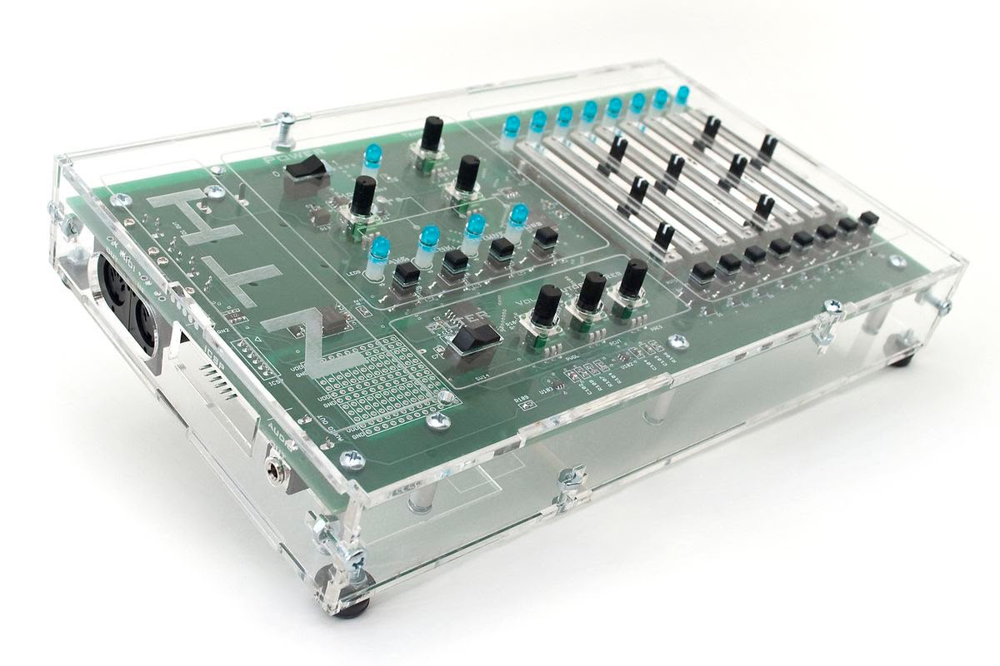
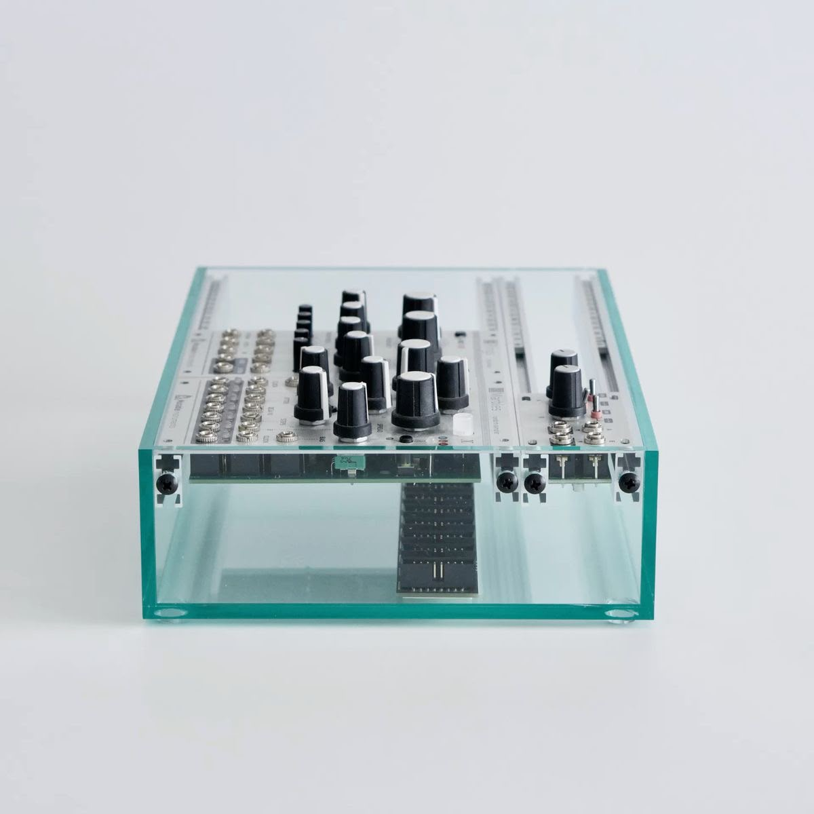
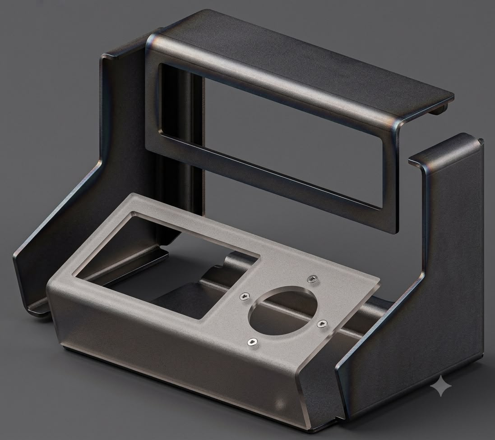

# sesion-13b

Clase 12 de junio 

*teloneo misaa*

*Partituras:* 
musica de pendulum: es un manual/instrucción

## **TRAER EL PROXIMO VIERNES**

-lista materiales que usaremos
  -ensamblaje de 3 pcbs de las que hayan participado en su diseño
    -propuesta de dos partituras para perfomance de 5min con el sitentizador diseñado

## **TRABAJO GRUPAL**

- Conectores magneticos Pogo
  
ver posibilidad de no usar cables y usar estos imanes que haras de conexión de placas

- Si usamos metal deberiamos hacer un modulo grande y no distintos modulos or costos y facilidad de uso
  
- Sensor de movimiento
  
- Ver que circuito haremos de los demas grupos

- tendremos que hacer que nuestro secuenciador prenda y apaguen luces basicamente, porque otros grupos no pusieron imput, seria algo divertido de averiguar 
  
# **Propuestas de materiales:**

- cemento/yeso
  - metal
    - acrilico
      - impresion 3d

  

# **TENER OJO**

- Ver posibilidad de hacer secciones de trasparencias
  - Ver como convive la humedad con la soldadura y los componentes

-tenemos para usar:
 - 2 Secuenciador si o si
  - Piezo
   - 1 filtro
     - reloj
       - Percusión 1 
  
## **Acuerdos como grupo**

- 1 solo modulo
- **Elowan a plant-robot hybrid**
    - https://www.media.mit.edu/projects/elowan-a-plant-robot-hybrid/overview/
- Para inspiraciones
  - https://loliel.narod.ru/DIY.pdf
- llegar con los dos secuenciadores y el piezo soldado para el viernes 19

## **Elección de circuitos** 

**GRUPO 01**

A nivel personal estoy considerando el Circuito 1 del Grupo 1 porque es una excelente solución para la etapa de entrada. Ellos lograron resolver muy bien la sensibilidad del piezo y la limpieza de los golpes, lo que nos daría esa interacción humana que buscamos para el sintetizador.
Si decidimos fusionar ambos diseños, se armaría un súper buen equipo: el circuito de ellos nos entrega los pulsos limpios cada vez que alguien golpea el sensor, y nuestro diseño se encarga de procesar esa información rítmica a través del CD4040 y el CD4017, para finalmente transformarla en notas musicales con nuestro oscilador

**GRUPO 03**

Puede que los circuitos de este grupo nos sirvan solo si decidimos meterle audio al proyecto, si queremos que los ritmos de nuestro CD4040 y CD4017 se escuchen como sonido o ruidos, nos sirve adoptar su chip de sonido (CD4046) y descartar el resto.
Sin embargo, como tenemos la opción de encargarnos solo de luces, pero si nos vamos por el camino de solo lo visual, el circuito de ellos no nos sirve. Nos bastaría con nuestros propios chips para controlar secuencias de LEDs, por lo que no necesitaríamos su oscilador ni sus salidas de audio.

**GRUPO 04**

Estos circuitos nos sirven si es que elegimos meterle audio al sintetizador. Podemos tomar su oscilador CD40106 el de la propuesta Chirihue, que tiene filtros de ataque y decaimiento, para transformar los ritmos de nuestro CD4040 y CD4017 en sonido, ruidos y texturas espaciales. De ellos descartamos su idea de agregar un CD4040, porque ya tenemos nuestro cd4040.
Por el contrario, si decidimos encargarnos solo de luces, este grupo no nos sirve. Si nos vamos por el camino 100% visual, nos bastaría con nuestros propios chips para controlar secuencias de LEDs, por lo que no necesitaríamos sus osciladores, filtros ni amplificadores de audio. Si elegimos audio, les tomamos solo su etapa de sonido del CD40106, y si elegimos luces, los descartamos por completo.

**GRUPO 05**

El proyecto de este grupo nos sirve si es que decidimos irnos por el camino del audio, ya que ellos diseñaron la herramienta perfecta para moldear el sonido, un filtro activo con el chip LM324. Si elegimos meterle audio al sintetizador, conectar los ritmos de nuestro CD4040 y CD4017 a su filtro estaria muy bueno, porque nos permitiría agarrar esos ruidos o sonido secos y darles textura, controlando el "ataque y decaimiento" para que suenen espaciales, como transmisiones de radio de la NASA. De ellos descartaria sus bloques de prueba con el CD4046 y sus ideas con el CD4040/CD4017, además de su propuesta de filtro pasivo, ya que nosotros ya estamos haciendo la lógica de ritmos por nuestra cuenta y el filtro pasivo apaga mucho el volumen.

**GRUPO 06**

El Circuito 1 (Lub-dub) es ideal para transformar nuestro secuenciador en una caja de ritmos, ya que sus filtros convierten los pulsos en golpes secos de batería. Si preferimos algo más ruidoso y experimental, el Circuito 2 (Barry Benson) nos sirve para usar nuestros chips como interruptores de su zumbido caótico. Sacaria los potenciómetros de tiempo, ya que nosotras controlariamos el ritmo.

**Elegiria los circuitos 05 y 06**

O sea nos quedaria el circuito del cd4040 y el cd 4017 y los circuitos del grupo 05 y 06? en mi opnion 
de igual manera soldaremos todas las placas para probarlas todas y ver como funcionan 

## **TEXTO YOKO ONO:LIBRO COMPLETO**

Sin darme cuenta, he hecho algunas cosas que salen en el libro.

por ejemplo, al leer esta instrucción de Yoko Ono, me di cuenta de que sin querer ya formaba parte de su obra, muchas veces a las 8 de la mañana y antes de irme a la universidad, hago exactamente lo que el libro propone, quedarme pegada mirando cómo hierve el agua, mientras reflexiono sobre la vida. 

El libro es una invitación a encontrar el arte y la introspección en las acciones más cotidianas, demostrando que la poesía visual y conceptual ya es parte de nuestra vida,de nuestra rutina, igual encuentro que algunas partes del libro son muy fuertes de hacer o muy extremistas, y otras me podrucen gracia, no haria algunas cosas que diceel libro, pero otras me gustarias intertarlas. 
