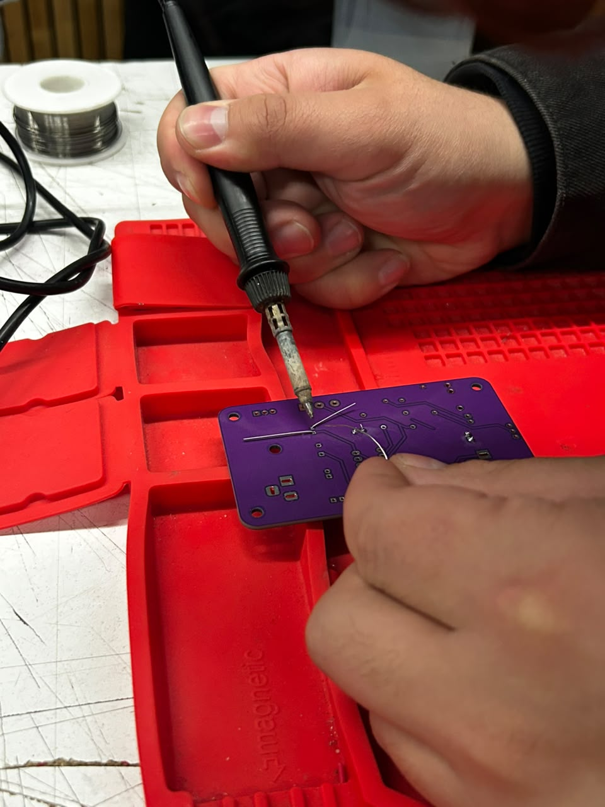
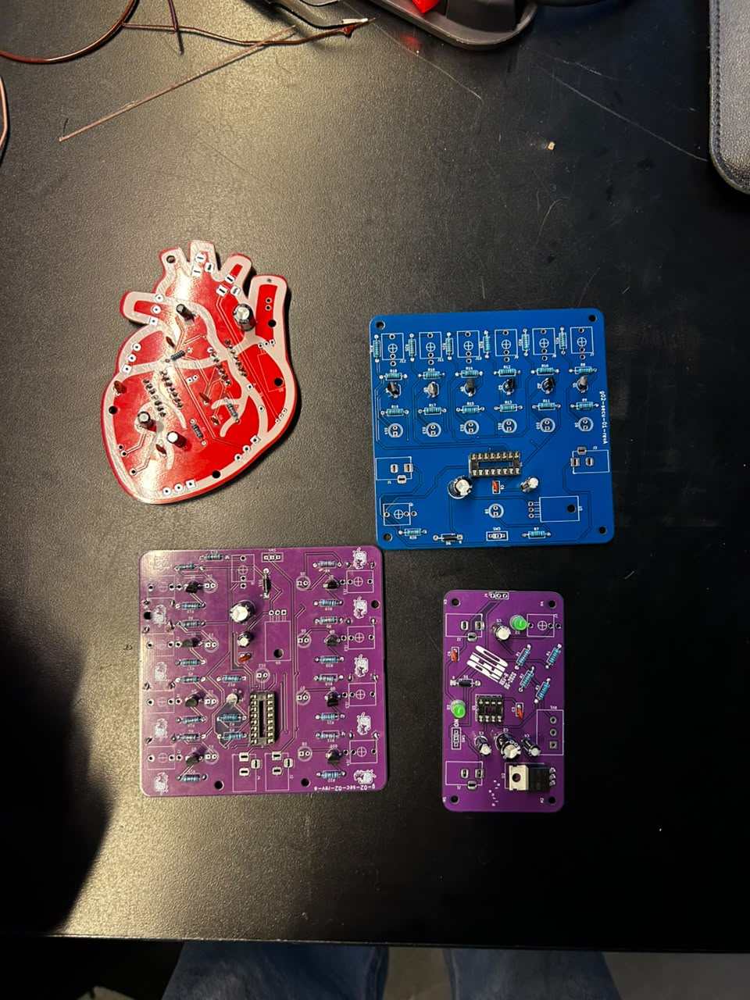
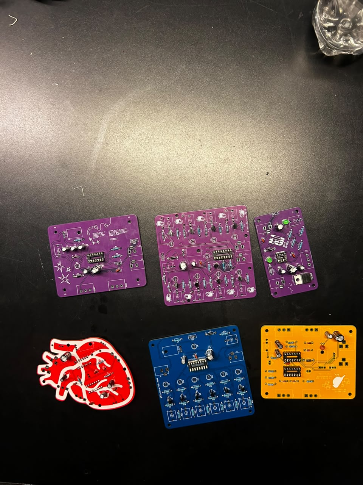
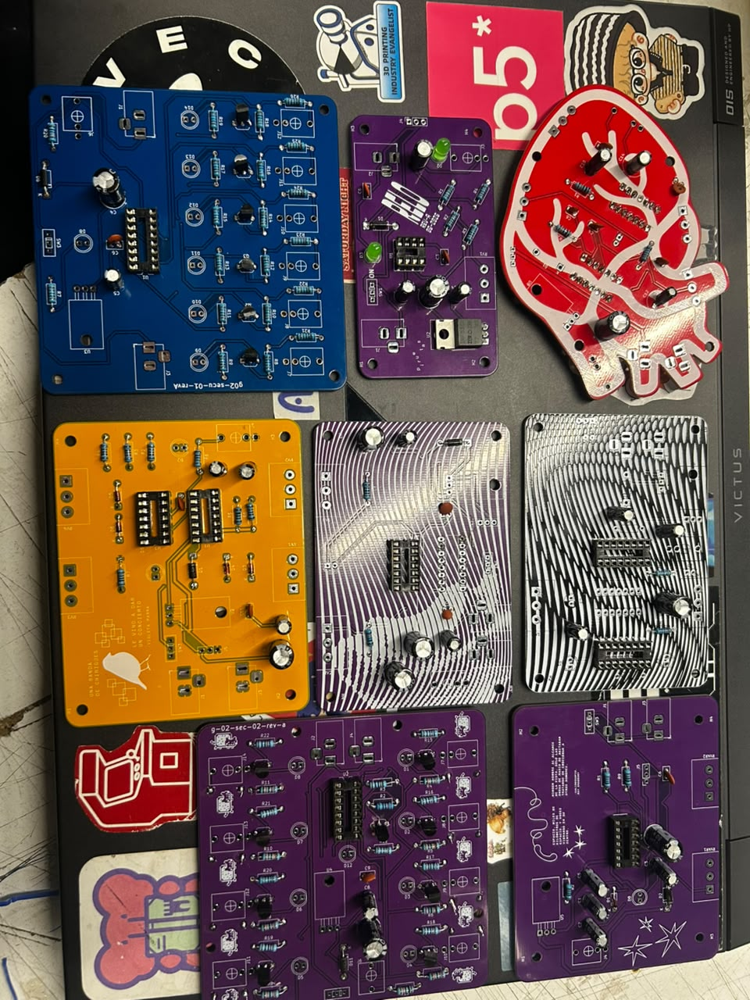
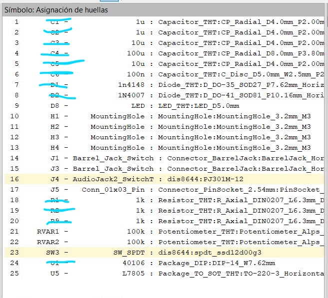
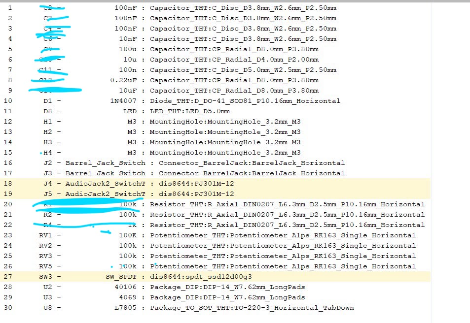
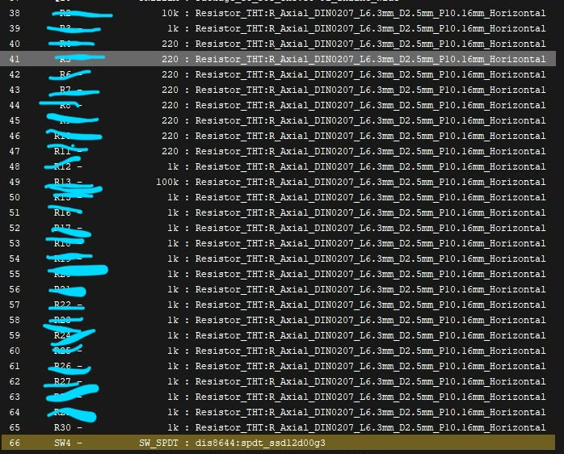
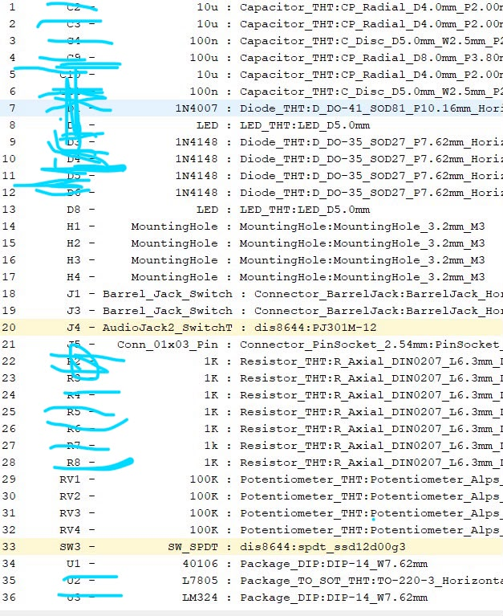

# sesion-14a

Clase 16 de junio

hoy sera clase de soldadura, y elección de circuitos.

## **PROCESO**
Al inicio de la clase, todos practicamos soldaduras y nos fuimos turnando para soldar los componentes.

Fue un proceso complicado pero divertido soldar, me queme los dedos pero todo bien, había escases de componentes asi que tuvimos que ir recogien capacitores, resistencias que veiamos por el suelo.

## **POST CLASE**

## **POST CLASE**

| Foto 1 | Foto 2 |
|---------|---------|
|  |  |

| Foto 3 | Foto 4 |
|---------|---------|
|  |  |

Para el proceso de soldadura, hice este proceso, fui tachando los componentes a medida que iba soldando para facilitarme el proceso y no perderme, empece un poco tarde este metodo y las primeras 3 placas me equivoque mucho con los valores de los componentes.

Igual me ayudo ir hablando con los otros grupos que dificultades presentaron al momento de soldar, y ellos me iban dando consejos para no equivocarme con sus placas, el cual se me hizo mucho mas facil soldar.

Nuestra idea era llegar con todas las placas soldadas por que no todas tenia IMPUT asi que para no complicarnos ibamos a probar con todas las placas soldadas, tambien queriamos ver la opcion de usar todas, por eso soldamos todo para pobralo en la marcha y no estar soldando a medida que ibamos provando.

No pude terminar de soldar por que se nos acabo los componentes del lid que necesitabamos, asi que angel se ofrecio para ir a comprar, estamos esperando a que nos traiga los componentes y podriamos terminar todo.

Igual más de la mitad del grupo se enfermo y no pudieron ayudar precensialmente pero se encargaron de los detalles de la presentación en sus casas, asi que todo salio bien dentro de lo que se podia.
