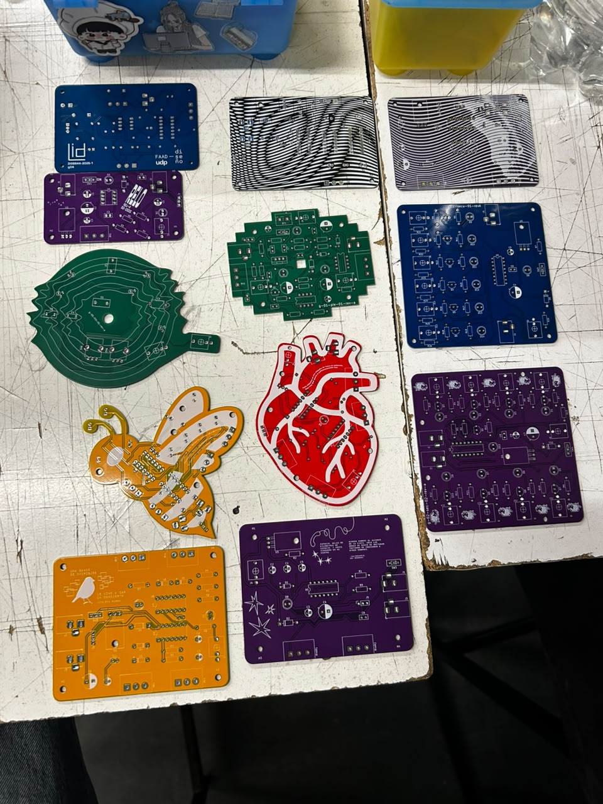
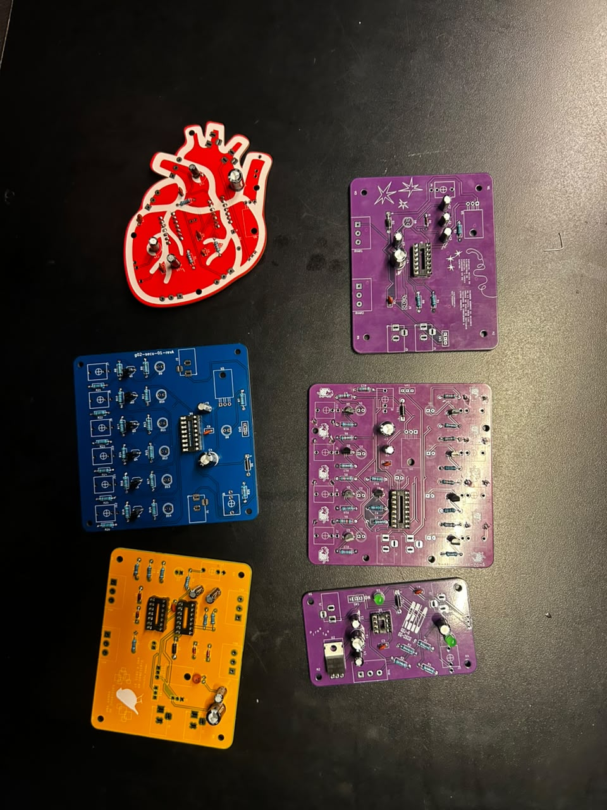

# sesion-14a

Martes 16 de junio

## Proceso

* Hoy usamos la clase para soldar las placas que nos llegaron y avanzar la mayor cantidad posible.

* Personalmente, me enfoqué más en encontrar y organizar los componentes para mis compañeres, aunque también pude soldar algunas placas. Me parece una actividad relajante.

* Hubo cierta escasez de componentes debido a la gran cantidad que debíamos utilizar entre todos los grupos.

* También me encargué de crear una lista en una tabla de Excel con los componentes utilizados por todos los grupos, aunque no alcancé a terminarla.

* Tabla de componentes:
  * https://docs.google.com/spreadsheets/d/1MNbLM79ZVTf3fx_7moei02GTcOYBVsi77NYSNhLA060/edit?gid=0#gid=0
