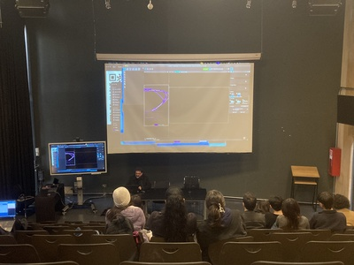
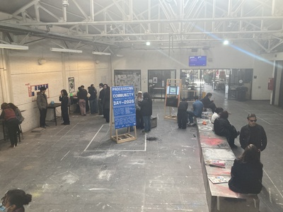
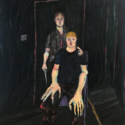
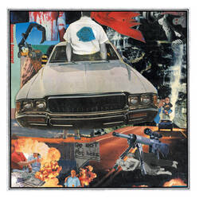
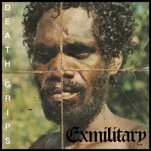
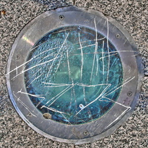
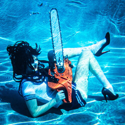
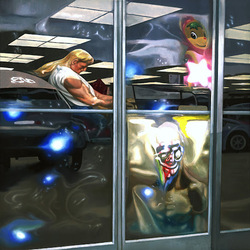

# sesion-14b

- ## processing community day!!!!!
  - hola es sabado y no hay que hacer bitacora pero me faltaba recomendar albumes asi que esta es mi excusa 🔥
 

  - en el PCD presentó CumaSystem con un workshop de processing y MadMapper
    - mostró varios de sus proyectos que involucraban sensores de sonido y luz
      - muy amable el personaje, al hacerle preguntas fue muy cercano(?) en el sentido de que no se sintó como "hola yo estoy hablando y por eso soy mejor que tu"
    - un proyecto que me encantó fue uno que reaccionaba a las distintas frecuencias de un audio
      - el audio que elegió fue uno que produjo al meter "raw data" a Audacity
        - la gracia del programa es que te deja meter literal cualquier archivo si no me equivoco
          - y te genera un audio
        - si no mal recuerdo yo una vez metí el Undertale.exe como "raw data" y me salió un audio largo y variado que me gustó mucho
          - los audio que salen al hacer esa tecnica suelen ser bastante ruidosos, algo que me gusta 🗣️
         

  - foto del espacio más abierto
    - fue harta gente y me encantó poder ver los proyectos de todos
      - toda la gente con la que hablé fue super buena onda y me respondían todas las preguntas que tenía sobre sus trabajos
    - alcanzé a ver el proyector abierto de misaaaaa antes de tener que irme por que me dolía la cabeza 🔥
   

ahora si....

- ## MUSICA PRO QUE ME FALTABA PONER
  - voy a poner una pequeña explicación de que es, que me gusta y algun que otro dato chistoso/interesante sobre la banda/artista
 

  - https://www.youtube.com/watch?v=mjnAE5go9dI
  - William Basinski
    - esta canción la encontré el primer semestre de la U si no me equivoco
      - al escribir esto me di cuenta que existe "1.1.1" y "1.1"
        - a mi me interesa "1.1"
      - canción de 1 hora y tanto
        - ambiental con unas trompetas si no me equivoco
          - mucho reverb, se escucha muy abierto y frio pero un frio rico
      - pude usar esta canción para un trabajo con mi profe Javi de taller (grande Javiera Figueroa)

-----------

  - he hablado mucho de este personaje
    - soy fan numero 1
  - Jasper Marsalis / Slauson Malone / Slauson Malone 1
    - porfavor busquen su trabajo
      - todo lo que hace es bueno e interesante
        - ya hablé de AQF y sus obras asociadas
        - ahora toca "Excelsior"
          - su segundo album pero más en especifico sobre 2 canciónes y sus videos
    - https://www.youtube.com/watch?v=C2_-bavZcLo
      - "New Joy" puede que sea mi video favorito suyo
        - dirigido por Parker Corey (1/3 de Injury Reserve)
        - me cuesta mucho describir o hablar de el video
          - el video más innovador que he visto en los ultimos años
            - y el primer video del que sé que tiene un speedpaint de su fursona, mukbang y un performance artistico
    - https://www.youtube.com/watch?v=QiDfM-ASkzE
      - este video se me vino a la mente viendo las cosas que nos mostraron en processing
        - con las gráficas que usan de radár, circulos, arcoiris, explosiónes etc...
          - además una muy buena canción

-----------

  - jockstrap es un duo de Georgia Ellery y Taylor Skye
    - Georgia Ellery también pertenece a Black Country, New Road
      - y el cambio entre estilos musicales me impacta cada vez
        - la capacidad de poder hacer ambos proyectos no es normal
  - "Beavercore" es un EP con 3 remixes de canciónes suyas y 3 composiciones más estilo orquesta
    - el rango que tienen como duo de tener canciónes full electronicas/dance/EDM y también poder hacer unos arreglos de violin con piano que me hacen llorar es algo que me alegra mucho
      - un ejemplo de lo más orquestral sería "Wet"
        - https://www.youtube.com/watch?v=tZOVSjURHxw
          - la primera canción que escucho con alguien duchandose al principio
            - que después se contorcióna y llega a esta sinfonía preciosa
  - algo que me gusta de "Jockstrap" es un estilo de trabajo que tienen
    - hacen un proyecto y luego lo remixean

  - aquí hicieron "I Love You Jennifer B"
    - y al año si no me equivoco sacan "I<3UQTINVU" donde colaboran con amigos para hacer remixes
      - es fascinante ver como pueden cambiar las emociones de una canción completamente
        - como de "Glasgow" --> "I Touch"
- en esta performace en vivo se ven ambas caras de lo que pueden hacer
  - https://www.youtube.com/watch?v=gLnbr8q89To
    - Live Laugh Love Georgia Ellery <3
      - su voz es preciosa por si fuera poquito lo que ya hacen
     
-----------

  - https://www.youtube.com/watch?v=NV1yUDs3kuE&list=PL5or9K_3B4mRblHMNaZFWS7RqqJ9Jy3eA
  - Odd Nosdam
    - honestamente no se mucho de quien es o que ha hecho fuera de este album
      - pero me importa mucho este proyecto suyo ya que gracia a una canción en especifico me dio una mini crisis existencial y ahora pienso distinto
        - entonces creo que es importante mencionarlo por lo menos
    - escuchando "Untitled One" y "Small Mr Man Pants" me empezé a cuestionar todo #lol
      - y gracias a este album ahora yo pienso que todo y nada está ocurriendo y que nada es realmente concreto
        - creo que ya hable de algo por el estilo pero cada vez que le explico esto a alguien le doy un ejemplo para que se entienda mejor
          - "Vladimir Putin está atras mio bailando la macarena"
            - ya pero, no creo que Putin esté en Santiago con tiempo de bailar la macarena
            - a mi parecer es muy cerrado de mente pensar que lo que uno ve/vive es si o si real
              - como se yo que justo en ese momento ocurrió un evento cosmico que teletransportó al personaje atras mio para bailar
                - como se yo que no estoy en un matrix? como puedo saber por certeza que mi computador no está hecho de queso?
                  - a lo que me refiero es que no hay un saber final y que uno se guía mucho por experiencias pasadas/expectatívas
          - David Hume habla más o menos de lo que digo con su teoría de la causalidad
            - https://iep.utm.edu/hume-causation/
           
-----------

  - cortisa star
    - rapera gringa que hace una mezcla de hyper-pop con rap
      - usa instrumentales muy locos y su estilo de producción es muy suyo
        - ya tiene su sello
        - https://www.youtube.com/watch?v=IxTJqJ1knnY
        - https://www.youtube.com/watch?v=oyHkYtDiI2k
        - https://www.youtube.com/watch?v=IB4ymq1D_zY
    - además fue/es? modelo para Miu Miu
      - viva la gente trans 🗣️
     
-----------

  - dreamcrusher no le gusta etiquetarse como un artista musical de noise
    - hace lo que le gusta y no necesita nombrar o categorizar que es
      - no se mucho sobre dreamcrusher pero esta canción es muy buena como para no compartir
  - https://www.youtube.com/watch?v=ISs-7ZH2F3c

-----------

  - no se como no hablé de este bello mixtape de Death Grips
    - https://www.youtube.com/watch?v=iPtPo8Sa3NE
      - uno de los mejores openers para un proyecto musical
        - musicalmente muy originales
          - la mezcla de sonidos y el uso de samples es impactante
            - tiene muchisima energía
      - recomiendo:
        - "Beware" 0:00
        - "Spread Eagle Cross The Block" 9:36
        - "Klink" 20:58

https://www.youtube.com/watch?v=CjC5_HrHQFs
  - uno de mis conciertos favoritos de ellos

  - otro de sus proyectos
    - probablemente mi album favorito de ellos
  - https://www.youtube.com/watch?v=2kDinXI0bxM&list=PLxi3HY4tL30_ki1vGG-tyTQI3FP1bXmEx

-----------

  - https://www.youtube.com/watch?v=m1ANKcK1qCM
    - escuchenla 🔥
      - 1:05 no es normal
     
-----------

  - https://www.youtube.com/watch?v=AEEesEP14a0
    - la ultima canción que han sacado
      - frost children es un duo de hermanos que hacen musica EDM e Indie Rock
    - un comentario me robó lo que quería decir asi que
      - "This song captures every edm phase I’ve had in my life" - @Tyc9909
     
-----------

  - https://www.youtube.com/watch?v=urf4-iz8MdM
  - menos mal esta canción no es **de** shinzo abe pero **sobre** el
    - canción noise muy cargada politicamente
      - el video muestra todo lo necesario para entender 👍
     
-----------

  - https://www.youtube.com/watch?v=l-CpeodyelI&list=OLAK5uy_nP0mNrjRPzVsBZYbBAggeQuyqmNEWUIY4
  - no tengo ni la menor idea de quienes son pero me aparecieron en una historia que subió Parker Corey
    - nuevamente una mezcla de orquestas con screamo(?) e inclúso algunas canciónes tiene spoken word
   
-----------

eso ok chao!!!!!!!!!!!!!!! ojala sea quien sea que lea esto pueda escuchar al menos una canción 👍
