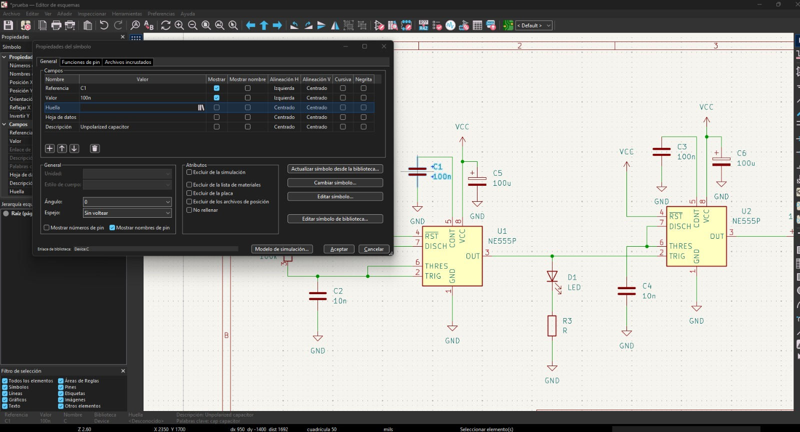
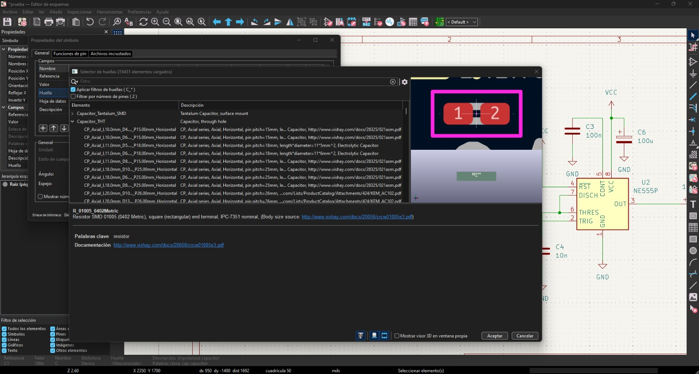
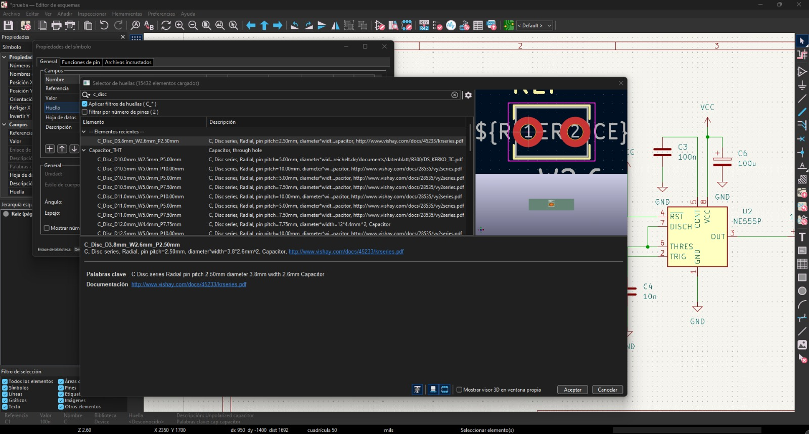
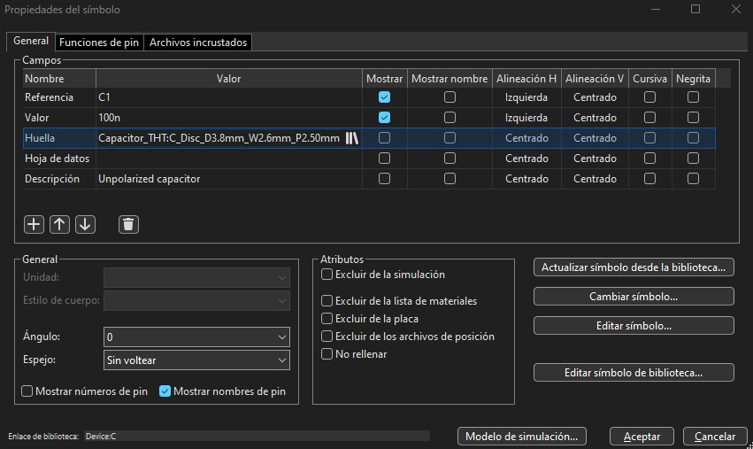

  

# 🌸 Clase 08a — Primer acercamiento a KiCad

  <b>Bitácora de clase — Diseño de circuitos y placas PCB</b> 
  En esta sesión comenzamos a trabajar con KiCad para pasar de un circuito esquemático a una placa física.

Aquí dejare una tabla con los atajos vistos en clase
| Atajo  | Tecla | Descripcion |
|---|---|---|
| Agragar componente | A |   Se abrira un panel donde esta la biblioteca de todos los componentes   |
| Mover | M | Se tiene que hacer click en el componente y apretar la "M" o solo tocar y arrastrar     |
| Duplicar | Ctrl+D |  Se debe hacer un click sobre el componente y apretar Ctrl+D    |
| Guardado | Ctrl+S |   NO CONFIARSE Y SIEMPRE GUARDAR!!!   |
| Valor | V |   Hacer click en el componente y deara editar el valor   |
| Rotar | R |   Hacer click en el componente y pretar "R" para rotar |
| Clables | 🖱️ | Hacer click de donde empieza la conexion y llevar hasta donde se conecta (Gif)     |

<!-- Aqui empieza el gif del circuito -->

  

<!-- Aqui termina el gif del circuito -->

Cuando abrimos la biblioteca usando "A" podemos ver una biblioteca con todos los componentes, y al igual que con la tabla de arriba, hay palabras claves para buscar los componentes que necesitamos
| 🔎  | Letra | Descripcion |
|---|---|---|
| Resistencias | r |   Por defecto se llama R1, si usamos el atajo para duplicar, el duplicado seguira una secuencia y el duplicado se llamara R2   |
| Capacitor | c |  El que utilizaremos estara en la seccion "Device"   |
| Capacitor Polarizado | c_p |   EL capacitor con un lado + y un - se llama Capacitor Polarizado  |
| Bateria | 🔋 |   Para buscar tenemos que ir a battery_cell: celda de bateria y encontraremos un repertorio  |
| Chips | 🐿️ |   Debe ponerse los numeros del chip a buscar y aparecera con diferentes letras, asi que hay que buscar el que se necesita   |

## Huella📚
Hacer 1 click sobre el componente y posteriormente apretar "E", el cual es un atao para que se abra un panel donde encontraremos donde editar la huella, como se ve en la imajen de abajo.
Luego iremos donde dice "huella" y apretaremos el simbolo en la casilla que dice valor y aparecera un simbolo asi -> /||

Luego se abrira un repertorio con varios componentes y sus medidas, debemos asegurar que si hicimos click en un Capacitor, debemos buscar los componentes del capacitor y asegurar que las medidas sean las mismas que la de nuestros componentes.
Para saber medidas de los componentes podemos ir a: www.victonics.cl

Cuando encontremos el componente que necesitamos y con las medidas correctas, le daremos click al componente encontrado en la biblioteca, y luego haremos click en aceptar o apretaremos la tecla enter.

Y listo! Ahora debes hacer estos pasos con todos los componentes de tu esquema antes de seguir avanzando.

