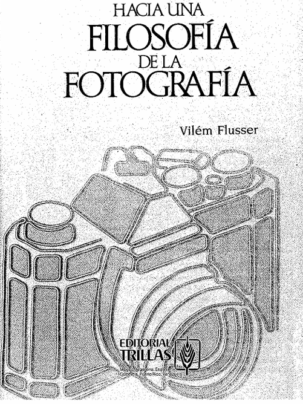

# Clase 09b — Hacia una filosofía de la fotografía

## Capítulo 2: La imagen técnica

En el segundo capítulo, Vilém Flusser explica que la imagen técnica es aquella producida por un aparato, como ocurre con la fotografía, el cine o la televisión. A diferencia de las imágenes tradicionales, que son creadas directamente por la mano humana, las imágenes técnicas surgen a partir de aparatos construidos sobre conocimientos científicos.

Para Flusser, las imágenes técnicas ocupan una posición histórica distinta a la de las imágenes tradicionales. Las imágenes tradicionales existieron antes de la escritura y se relacionaban directamente con el mundo concreto. En cambio, las imágenes técnicas aparecen después de los textos científicos avanzados. Por eso, no representan directamente el mundo, sino conceptos producidos por textos científicos.

El autor señala que las imágenes técnicas son más difíciles de descifrar porque parecen objetivas. Al mirar una fotografía, por ejemplo, el observador tiende a creer que está viendo una copia fiel de la realidad, como si la imagen fuera una ventana al mundo. Sin embargo, Flusser advierte que esta objetividad es una ilusión. Las imágenes técnicas también son símbolos y, por lo tanto, deben ser interpretadas.

El problema principal es que el proceso de producción de estas imágenes ocurre dentro de una “caja negra”. Entre el mundo y la imagen se interpone un aparato, como la cámara, junto con la persona que la utiliza. Aunque parece que la imagen surge automáticamente de la realidad, en verdad está mediada por procesos técnicos, ópticos, químicos, mecánicos y conceptuales que no son visibles para el observador.

Flusser afirma que las imágenes técnicas no son ventanas, sino imágenes. Como toda imagen, traducen el mundo en situaciones y producen una forma de magia. Sin embargo, esta magia no es igual a la magia de las imágenes tradicionales. La magia antigua era prehistórica y estaba relacionada con los mitos; la magia de las imágenes técnicas es poshistórica y está relacionada con los programas.

La función de las imágenes técnicas es reemplazar el pensamiento conceptual por una nueva forma de imaginación. Mientras la escritura había surgido para “desmagizar” las imágenes tradicionales, la fotografía aparece en el siglo XIX para volver a cargar los textos de magia. Por eso, Flusser considera que la invención de la fotografía es tan importante como la invención de la escritura lineal.

El autor explica que, durante el siglo XIX, la expansión de la prensa y la educación pública hizo que los textos se volvieran masivos. Esto produjo una división en la cultura: por un lado, las imágenes tradicionales se refugiaron en museos y galerías; por otro, los textos científicos se volvieron herméticos y difíciles de comprender; finalmente, los textos baratos circularon entre las masas. Las imágenes técnicas surgieron como intento de reunificar esa cultura dividida.

Sin embargo, Flusser sostiene que las imágenes técnicas no lograron cumplir esa función. En vez de reunir nuevamente arte, ciencia y política, sustituyeron las imágenes tradicionales por reproducciones, simplificaron o falsificaron los textos científicos y reemplazaron la magia de los textos populares por una nueva magia programada. Así, en lugar de reunificar la civilización, contribuyeron a formar una cultura de masas.

El capítulo concluye planteando que las imágenes técnicas absorben la historia en sus superficies. Todo acontecimiento busca transformarse en fotografía, cine o televisión para volverse reproducible. Como consecuencia, los hechos pierden su carácter histórico y se transforman en rituales repetidos. Desde esta perspectiva, la fotografía debe entenderse como parte de un universo técnico que reestructura nuestra forma de ver, pensar y actuar.

