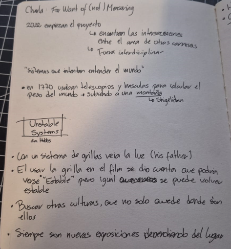
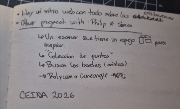

# Clase 10a — Flusser, imágenes técnicas y control de voltaje

**Fecha:** martes 19 de mayo de 2026  
**Tema:** Flusser, aparatos, medición, escaneo 3D y repaso de chips

---

## Repaso de Flusser

Durante la primera parte de la clase se retomaron ideas del libro **Hacia una filosofía de la fotografía**. Los conceptos principales fueron:

```text
Imagen
Imagen técnica
Aparato
```

Por lo que entendí, Flusser plantea que las imágenes y los textos no son simplemente una copia del mundo, sino formas de interpretarlo. O sea, cuando miramos una imagen, no estamos viendo el mundo tal cual es, sino una versión del mundo construida desde cierto sistema.

También se habló de que las imágenes tradicionales y los textos fueron tomando distintos lugares dentro de la cultura. Las imágenes se fueron más hacia el museo y el arte, mientras que los textos se fueron hacia la ciencia, los diarios, los medios y otros espacios más cotidianos.

| Elemento | Lugar o función | Valor asociado |
|---|---|---|
| Imagen tradicional | Museo / arte | Belleza |
| Texto científico | Ciencia | Verdad |
| Texto barato o masivo | Diario, celular, medios cotidianos | Información rápida o consumo |

Esto se relaciona con la aparición de las imágenes técnicas, porque estas intentan volver a mezclar o transformar esa relación entre imagen, texto y mundo.

---

## El aparato como caja negra

Uno de los conceptos más importantes fue el de **caja negra**.

Un aparato puede entenderse como una caja negra porque recibe una entrada, hace algo internamente que no siempre entendemos y después entrega una salida.

```text
Entrada → Aparato → Salida
```

Por ejemplo, en el caso de una cámara:

```text
Mundo exterior → Cámara → Imagen técnica
```

La cámara parece mostrarnos el mundo como si fuera algo directo y objetivo, pero en realidad produce una versión limitada del mundo. Esa imagen depende del aparato, de su programa, de sus posibilidades técnicas y también de cómo lo usamos.

Esto también se puede conectar con el sonido, porque nuestro imaginario sonoro o musical muchas veces se construye a partir de aparatos. Por ejemplo, un sintetizador, un chip o un parlante también hacen que escuchemos el mundo de cierta forma.

---

## Charla — For Want of (Not) Measuring

La charla trató sobre un proyecto que comenzó en **2022** y que nació desde el cruce entre el trabajo de distintas personas creadoras. Con el tiempo, el proyecto fue creciendo y se convirtió en varias exposiciones, publicaciones y colaboraciones.

El tema principal era la **medición**. El proyecto se pregunta qué pasa cuando usamos sistemas de medición para entender la vida y el mundo, pero también qué pasa cuando esos sistemas no son tan estables como parecen.

Me llamó la atención que no se trataba solo de medir por medir, sino de pensar qué significa medir. A veces confiamos mucho en los sistemas exactos, como las grillas, los escáneres o los números, pero cuando se miran con más atención aparecen errores, diferencias y cosas que no calzan tan perfectamente.





---

## Medir el mundo

En la charla se mencionó una historia de hace aproximadamente **300 años**, cuando un grupo de personas intentó calcular el peso del mundo. Para eso subieron a una montaña en Escocia usando instrumentos como péndulos y telescopios.

Esta historia servía para mostrar que medir siempre ha sido una forma de intentar entender el mundo. Pero también muestra que la medición depende de herramientas, contextos, errores y decisiones humanas.

Entonces medir no es solo algo técnico. También puede tener una parte simbólica, artística, cultural o incluso política.

---

## Sistemas inestables

Otro concepto importante fue el de **sistemas inestables**.

La charla mostraba que algunos sistemas parecen muy ordenados y exactos, pero al mirarlos de cerca se vuelven más inestables. Un ejemplo de eso era la **grilla**. Una grilla parece perfecta, cuadrada y controlada, pero igual representa una forma de ordenar algo que en realidad puede ser mucho más cambiante.

```text
Grilla = orden aparente
Mundo real = movimiento, error, cambio e inestabilidad
```

Esto se conecta con Flusser porque los aparatos también ordenan el mundo, pero no lo hacen de manera neutral. Siempre muestran una versión del mundo, no el mundo completo.

---

## Escáner, láser y nube de puntos

Una parte importante de la charla fue cuando explicaron el uso de un **escáner 3D**. Este aparato usa un láser que choca con el entorno físico y registra puntos del espacio.

El escáner no captura el mundo como una superficie continua, sino como una gran cantidad de puntos. Cada punto representa un impacto del láser contra una superficie.

A eso se le llama:

```text
Nube de puntos
```

La nube de puntos parece muy precisa, pero en realidad es una reconstrucción fragmentada del mundo. El mundo real es continuo, pero el escáner lo transforma en puntos separados.

```text
Mundo físico → Láser → Puntos → Nube de puntos → Modelo digital
```

Esto se parece mucho a la idea de imagen técnica, porque el escáner no solo registra la realidad: la transforma en un modelo producido por un aparato.

---

## El árbol como red viva

Uno de los ejemplos que más me llamó la atención fue el escaneo de un árbol de más de **300 años**. En vez de verlo solamente como un objeto sólido, se propuso entenderlo como una **red viva**.

El árbol crece, cambia y se adapta a lo que pasa alrededor. Sus ramas se podían ver como relámpagos, ondas, frecuencias o conexiones. Entonces el árbol deja de ser solo “un árbol” y empieza a verse como un sistema de fuerzas y relaciones.

También se habló del tiempo y la escala:

| Perspectiva | Cómo se entiende el tiempo |
|---|---|
| Para nosotras | El árbol parece lento |
| Para el árbol | Las personas somos rápidas |
| Para una montaña | El árbol también podría parecer rápido |

Esto me pareció muy interesante porque al final todo depende de desde dónde se mire. Lo que para una persona parece lento, para otra escala puede ser rápido.

---

## Medición, juego y error

Normalmente, herramientas como los escáneres se usan para cosas técnicas, como medir edificios, hacer modelos arquitectónicos o registrar espacios. Pero en este proyecto se usaban de una forma más experimental.

En vez de ocupar el aparato solo para medir correctamente, lo usaban también para jugar, explorar y ver qué errores aparecían.

```text
Uso técnico → medir bien
Uso artístico → jugar, explorar y aprovechar el error
```

Esto se conecta mucho con Flusser, porque un aparato puede estar diseñado para una función específica, pero también se puede usar de otra manera. Ahí aparece la posibilidad creativa: usar el aparato más allá de lo que supuestamente debería hacer.

También se mencionó que hoy se pueden hacer experimentos parecidos desde el celular con aplicaciones como:

```text
Polycam
```

Eso muestra que algunas herramientas que antes parecían muy industriales o especializadas ahora están mucho más cerca de cualquier persona.

---

## Publicaciones y archivo

Otro punto interesante fue la idea de expandir el concepto de **publicación**.

Por cada exposición, el proyecto genera publicaciones con textos, imágenes, pensamientos, registros y otros formatos. No son solo catálogos tradicionales, sino una forma de seguir pensando el proyecto después de la exposición.

```text
Exposición → Publicación → Archivo → Nuevas conexiones
```

Cada exposición funciona como una nueva versión del proyecto, porque cambia según el lugar, las personas que participan y el contexto donde se presenta.

---

## Repaso técnico — Control de voltaje

Después de la charla, hicimos un repaso de conceptos electrónicos que pueden servir para nuestros proyectos.

Uno de los conceptos principales fue el **control de voltaje**. Para explicarlo se usó el ejemplo de una copa de agua: mientras más arriba está la copa, más presión tiene el agua.

Con el voltaje pasa algo parecido. El circuito puede trabajar dentro de un rango, por ejemplo entre:

```text
0V y 9V
```

Ese espacio entre **Ground** y **VCC** se puede entender como un rango donde el voltaje cambia y modifica el comportamiento del circuito.

---

## 4046 — Voltaje a frecuencia

El chip **4046** fue explicado como una caja negra que convierte control de voltaje en frecuencia.

```text
Voltaje bajo  → frecuencia más lenta / sonido más grave
Voltaje alto  → frecuencia más rápida / sonido más agudo
```

Esto se relaciona con el concepto de **VCO**, que significa:

```text
Voltage Controlled Oscillator
Oscilador controlado por voltaje
```

Un VCO cambia su frecuencia según el voltaje que recibe. Entonces, si cambia el voltaje de entrada, también cambia el tono o la velocidad de la oscilación.

---

## 4093, 555 y resistencia a frecuencia

También se mencionó que algunos circuitos permiten convertir cambios de resistencia en cambios de frecuencia.

Por ejemplo:

```text
4093 + 555 → resistencia a frecuencia
```

Esto se relaciona con el potenciómetro, porque un potenciómetro es una resistencia variable. Al moverlo, cambia la resistencia, y eso puede modificar el comportamiento del circuito, como el tono o la frecuencia.

---

## 4040 — Binary counter

El chip **4040** fue mencionado como un **binary counter** o contador binario.

Este chip puede dividir o contar pulsos. En simple, puede tomar una señal rápida y generar salidas más lentas.

```text
Entrada rápida → salidas divididas / más lentas
```

Esto puede servir para generar patrones, divisiones rítmicas o variaciones a partir de una frecuencia principal.

---

## Multiplexor

También se habló del **multiplexor**.

Un multiplexor permite elegir entre varias señales de entrada y decidir cuál de ellas va a salir por una sola salida.

```text
Entrada 1 ┐
Entrada 2 ├→ Multiplexor → Salida
Entrada 3 ┘
```

La idea principal es:

```text
Cada información es un voltaje
Una señal decide cuál voltaje sale
```

Esto puede servir para seleccionar entre distintos sonidos, tonos, controles o comportamientos dentro de un circuito.

---

## Otros componentes mencionados

| Componente | Idea principal |
|---|---|
| `4046` | Convierte voltaje en frecuencia. |
| `4093` | Puede usarse para transformar resistencia en frecuencia. |
| `555` | Temporizador/oscilador útil para generar pulsos. |
| `4040` | Contador binario que divide señales. |
| Multiplexor | Selecciona una señal entre varias entradas. |
| Relé | Funciona como interruptor controlado eléctricamente. |
| `LM741` | Amplificador operacional. |
| `LM358` | Amplificador operacional. |
| `LM324` | Amplificador operacional múltiple. |

---

## Resumen — Capítulo 4: El acto de fotografiar

En el capítulo **“El acto de fotografiar”**, Flusser explica que fotografiar no es solamente apretar un botón. El acto de tomar una fotografía ocurre en una relación entre el **fotógrafo** y la **cámara**.

El fotógrafo puede sentir que es libre porque elige qué fotografiar, desde qué ángulo hacerlo o qué imagen quiere lograr. Pero Flusser dice que esa libertad no es total, porque la cámara ya tiene un programa y ciertas posibilidades definidas. Entonces, el fotógrafo decide, pero decide dentro de lo que el aparato permite.

```text
Fotógrafo + Cámara = acto fotográfico
```

La cámara no es una herramienta completamente neutral. Aunque parece que obedece al fotógrafo, también lo condiciona. Todo lo que se fotografía tiene que transformarse en algo que la cámara pueda capturar.

Una idea que me pareció importante es que no existe una fotografía totalmente ingenua. Aunque parezca espontánea, siempre hay decisiones técnicas, culturales y visuales involucradas.

Flusser también compara el acto de fotografiar con una especie de cacería. El fotógrafo busca, se mueve, encuadra, prueba, duda y decide. Pero esa búsqueda ocurre dentro de las posibilidades de la cámara.

```text
Fotografiar = buscar posibilidades dentro del programa de la cámara
```

En resumen, fotografiar es un acto que está programado por el aparato, pero que también puede tener espacio para la creatividad. El fotógrafo puede intentar jugar contra la cámara para producir imágenes menos obvias o más inesperadas.

---

## Resumen — Capítulo 5: La fotografía

En el capítulo **“La fotografía”**, Flusser analiza qué es una fotografía y cómo deberíamos mirarla. Parte diciendo que las fotografías están en todas partes: revistas, libros, carteles, diarios, cajas, álbumes y objetos cotidianos.

Como están tan presentes, muchas veces las miramos sin pensarlas demasiado. Creemos que una fotografía muestra una situación real tal como ocurrió, casi como si fuera una copia directa del mundo. Pero Flusser dice que esa idea es engañosa.

La fotografía no es una ventana transparente hacia la realidad. Es una imagen técnica producida por un aparato.

```text
Mundo exterior → Cámara → Fotografía
```

Un ejemplo que usa Flusser es la fotografía en blanco y negro. El blanco y el negro no existen como situaciones puras en el mundo real, sino que son conceptos relacionados con la luz. Entonces, una foto en blanco y negro no copia el mundo directamente, sino que transforma conceptos ópticos en imagen.

También pasa algo parecido con la fotografía a color. Aunque parece más realista, igual está construida desde procesos técnicos y químicos. Mientras más “natural” parece una fotografía, más puede esconder su origen técnico.

```text
La fotografía parece natural,
pero está construida por conceptos y aparatos.
```

Para Flusser, descifrar una fotografía significa mirar más allá de lo que aparece en la imagen. Hay que preguntarse qué quiso hacer el fotógrafo, qué permitió la cámara y qué programa técnico está funcionando detrás.

| Fuerza | Qué busca |
|---|---|
| Intención del fotógrafo | Expresar una mirada, idea o concepto. |
| Programa de la cámara | Realizar sus posibilidades técnicas. |

La fotografía aparece como el resultado de una tensión entre estas dos fuerzas. Por eso, una buena crítica fotográfica debería preguntarse si el fotógrafo logró dominar el programa de la cámara o si la cámara terminó condicionando demasiado la imagen.

En resumen, Flusser plantea que las fotografías deben ser descifradas. Si las aceptamos sin pensarlas, pueden terminar programando nuestra forma de mirar y entender el mundo.

---

## Reflexión personal 

Estos capítulos me hicieron pensar que una cámara no es solo una herramienta para guardar recuerdos. Según Flusser, la cámara también guía, limita y condiciona la forma en que vemos el mundo.

Uno puede creer que toma una foto libremente, pero esa libertad está atravesada por las posibilidades que el aparato ya trae. La cámara permite ciertas cosas y otras no, entonces nuestra mirada también se adapta a eso.

Me gustó la idea de que fotografiar sea como jugar contra la cámara. No se trata solo de usar el aparato como viene, sino de intentar llevarlo hacia lugares menos obvios. Esto se puede relacionar con lo que vimos en la charla, porque el escáner 3D también fue usado más allá de su función técnica. En vez de solo medir, se usó para experimentar.

```text
Entrada → Aparato → Salida
```

La idea de caja negra también aparece de nuevo. Sabemos qué entra y qué sale, pero muchas veces no entendemos todo lo que ocurre dentro del aparato. Eso pasa con una cámara, un escáner, un celular o incluso un chip.

También me quedó dando vueltas que una fotografía no copia directamente la realidad. Aunque parezca objetiva, siempre está construida por decisiones, conceptos y procesos técnicos. Esto cambia la forma de mirar imágenes, porque obliga a preguntarse qué hay detrás.

En conclusión, me quedo con la idea de que los aparatos no son neutros. Nos ayudan a crear, medir, registrar y escuchar, pero también condicionan la forma en que imaginamos el mundo. Por eso, usar un aparato de forma creativa implica entender sus límites y tratar de empujarlo un poco más allá de lo que normalmente está programado para hacer.


